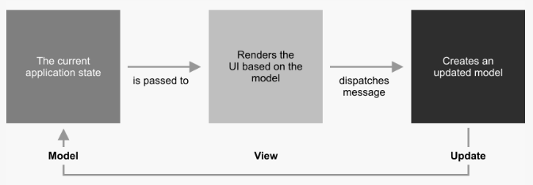
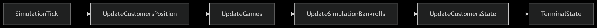

# Casimo Documentation

## Adopted Development Process
### Task division
The development process was divided into three main themes:
- Games logic (assigned to Ghignatti): responsible for implementing the core game logic.
- Customer movement behaviour (assigned to Patrignani): responsible for implementing the customer movement.
- Customer in-game behaviour (assigned to Galeri): responsible for implementing the customer in-game behaviour.

### Planned meetings/interactions
Each week the team holds a sprint start meeting in which the team establishes the tasks to be completed in the next sprint and an effort estimation. Then each task is assigned to a team member according to both the overall effort of each member and the theme of the task.
When a blocker is encountered during the development of a task, the team holds a meeting to discuss the issue and pair programming methodology is applied.
At the end of the week a retrospective meeting is held to review the progress of the tasks and to discuss any issues that may have arisen during the week.

### Choice of test/build/continuous integration tools
The team has chosen to use GitHub Actions for continuous integration and deployment. In particular a pipeline has been set up to build and run tests of the project. If the build is successful the application is deployed to the GitHub Pages of the repository.
The documentation is also automatically generated and deployed to the GitHub Pages of the repository.

## Requirement Specification
### Business requirements
The application is intended to be used by the manager of a [casino](https://en.wikipedia.org/wiki/Casino) who wants to simulate the behaviour of customers inside a given configuration of the casino in order to predict the revenue of the facility. The manager can configure the spacial organization of the casino (such walls and games) and the behaviour of both games and customers. 

### Domain model
- **Customer**: a person who enters the casino and plays games.
- **Game**: a game that can be played by customers, such as roulette, blackjack, etc.

### Functional requirements
#### User requirements

#### System requirements

### Non-functional requirements

### Implementation requirements

## Architectural Design
### Overall architecture
The application rely on a MVU (Model-View-Update) architecture, which is a purely functional architecture. 
Core concepts of this architecture are:
- **Model**: Represents the state of the application, a pure, immutable data structure where all state changes produce new instances.
- **View**: A function that takes the model and produces a view, which is a description of what the user interface should look like.
- **Update**: A function that takes the current model and an event (or action) and produces a new model, representing the new state of the application.



Cornerstone of this architecture is the unidirectional data flow, where at the center of the architecture is the update function, which process messages 
sent by the view and produces a new model. This kind of update function is what allow this architecture to simulate the loop of a traditional simulation application, 
maintaining the purely functional nature of the application.


### Description of architectural patterns used

### Any distributed system components

### Crucial technological choices for architecture
#### Scala.js + Laminar: Reactive Frontend & Continuous Deployment

The application rely on a browser-native UI built using **Scala.js** with **Laminar**. This choice was driven by the ability to have a continuous deployment via GitHub Pages while also adopting well to the MVU architecture. 

Laminar **fine-grained reactivity** ensures that view components update automatically when the model changes, perfectly complementing the MVU dataflow `Model → View → Update` cycle. Rather than manually propagating new state, Laminar delivers updates precisely where they’re needed.
Also, DOM changes are direct without the need of virtual-DOM abstraction, avoiding performance bottlenecks and potential stale-state problem common with other web framework.

- **Continuous Deployment**  
  Since Scala.js outputs JavaScript and HTML, our pipeline can **automatically build, test, and deploy** the application on every change. This continuous deployment setup ensures the latest version is always live without manual intervention needed.
### Diagrams

## Detailed Design
### Relevant design choices
An important design choice in our application is the use of a MVU architecture, which dictates how the application is structured and how data flows through it.
Cornerstone component is the update function, which has been designed in a way to simulate a loop in order to allow a better management of the simulation state.


#### Customer Composition

We choose to implement the `Customer` behavior using **F‑bounded polymorphic traits**. This choice brings some great feature enabling a **modular** and **extensible** design.

```scala 3
case class Customer(
    id: String,
    bankroll: Double,
    customerState: CustState = Idle
) extends Entity,
      Bankroll[Customer],
      CustomerState[Customer]:

  protected def updatedBankroll(newRoll: Double): Customer =
    this.copy(bankroll = newRoll)

  protected def changedState(newState: CustState): Customer =
    this.copy(customerState = newState)
```
```scala 3
trait Bankroll[T <: Bankroll[T]]:
  val bankroll: Double
  require(
    bankroll >= 0,
    s"Bankroll amount must be positive, instead is $bankroll"
  )

  def updateBankroll(netValue: Double): T =
    val newBankroll = bankroll + netValue
    require(
      newBankroll >= 0,
      s"Bankroll amount must be positive, instead is $newBankroll"
    )
    updatedBankroll(newBankroll)

  protected def updatedBankroll(newBankroll: Double): T
```

The key strength of this design are:

- **Strong type safety**  
  F‑bounded traits restrict generic parameters to subtypes of the trait itself, preventing accidental type error at compile time.

- **Precise APIs and seamless mvu updates**  
  By encoding the concrete subtype via `C <: Trait[C]`, trait methods can return `C` directly, enabling `.copy(...)` function in the Customer producing a new instance in a clean and optimize way. This avoids casts or losing type specificity in method returns making updating state easier.

```scala 3
val newCustomer = Customer(id = "myCustomer", bankroll = 50.0)
val updatedCustomer = newCustomer.updateBankroll(-20.0)
// ad-hoc method for update that checks that bankroll don't go below zero
```
- **Modular and extensible architecture**  
  Each behavior (e.g., bankroll, boredom, status) is isolated within its own trait. This allows introducing new behaviour without altering existing implementations by just defining the trait and mix it in.
```scala 3
case class Customer(
id: String,
bankroll: Double,
customerState: CustState = Idle,
boredom: Double
) extends Entity,
Bankroll[Customer],
CustomerState[Customer],
Boredom[Customer]: // Just adding a new behaviour to the Customer by composition

```
By leveraging these traits composition system, our `Customer` model stays **type safe**, **cohesive**, and easy to evolve, supporting future expansion of behaviors and customer types without compromising the maintainability.

### Design patterns

### Code organization

### Diagrams

## Implementation
### Student contributions
Nicolò Ghignatti
#### Result
Having to deal with data which can have two states (win or loss for a bet, for example) can be quite annoying so, I've 
decided to implement a monad which can do it for us. Basically it is a enum which can have 2 states: a 
`Success` or a `Failure`:
```scala
package utils

enum Result[+T, +E]:
  case Success(value: T)
  case Failure(error: E)

  def map[U](f: T => U): Result[U, E] = this match
    case Success(value) => Success(f(value))
    case Failure(error) => Failure(error)

  def flatMap[U, F](f: T => Result[U, F]): Result[U, E | F] = this match
    case Success(value) => f(value)
    case Failure(error) => Failure(error)

  def getOrElse[U >: T](default: U): U = this match
    case Success(value) => value
    case Failure(_)     => default

  def isSuccess: Boolean = this match
    case Success(_) => true
    case Failure(_) => false

  def isFailure: Boolean = !isSuccess
```
This kind of implementation help also in the error handling

#### Games
I've dealt with the game implementation in their totality. The crucial point was dealing with the customers, so useful APIs
have been implemented, allowing the players to join games and play them.
```scala
class Game extends Entity:
  def gameType: GameType
  def lock: Result
  def unlock: Result
  def play: Result
```
An important task was to manage the customers joining a game, allowing the to join if possible, otherwise block them.
This mechanism has been implemented in a `GameState` which manage the join/leave mechanism:
Instead the logic of the games was implemented using an internal DSL, which expose useful stuff to implement strategies
in an easy way:
```scala
// this is an example of how the game strategy DSL was implemented
trait GameStrategy:
    def use(): Result[Double, Double]

object SlotStrategy:
    def apply: SlotStrategyBuilder = SlotStrategyBuilder()

case class SlotStrategyBuilder( betAmount, condition):
    def bet(amount: Double): SlotStrategyBuilder =
      require(amount > 0.0, "Bet amount must be positive")
    this.copy(betAmount = Some(amount))

def when(cond: => Boolean): SlotStrategyInstance =
  SlotStrategyInstance(betAmount.getOrElse(0.0), () => cond)

case class SlotStrategyInstance(betAmount, condition) extends GameStrategy:
    override def use(): Result[Double, Double] =
        val values =
          for _ <- 1 to 5 yield Random.nextInt(5) + 1
        if condition() && values.distinct.size == 1 then
          Result.Success(betAmount * 10)
        else Result.Failure(betAmount)
```
Allowing an easy creation like the following:
```scala 3
val bankroll = 10.0
use(SlotStrategy) bet 5.0 when (bankRoll > 0.0)
```
### Important implementation aspects

## Testing
### Technologies used
For testing our code we used ScalaTest, probably, the most widely used and flexible testing framework for Scala.
The choice of this testing technology has different pros:
- **Rich Testing Styles**: With multiple built-in styles—such as FlatSpec, FunSuite, FunSpec, WordSpec, FreeSpec, 
    PropSpec, and FeatureSpec—ScalaTest enables you to write tests in the style that best fits your needs: xUnit, BDD, 
    nested specification, or property-based testing
- **Powerful Matchers & DSL**: ScalaTest includes expressive matchers that allow fluent assertions
- **Deep Ecosystem Integration**: ScalaTest integrates with build tools and frameworks including sbt, Maven, Gradle, 
    IntelliJ, Eclipse, and testing tools like JUnit, TestNG, ScalaCheck, JMock, EasyMock, Mockito, and Selenium

### Coverage level

### Methodology used

### Relevant examples

### Other useful elements

## Retrospective
### Development progress, backlog, iterations

### Final comments
