# Casimo Documentation

## Adopted Development Process

### Methodology
A **SCRUM**-inspired development process was adopted, as suggested, in order to ensure an agile and iterative management of the project activities.

Throughout the entire project lifecycle, the quality of the process improved in parallel with the growth of the development team,
which successfully tackled the project challenges, gradually strengthening its synergy and cohesion.

### Roles
- **Product Owner**: Luca Patrignani,  responsible for monitoring the project’s progress, ensuring alignment with business objectives, coordinating the development team, and also serving as a developer.
- **Team member**: Nicolò Ghignatti, member of the dev team which is responsible for the project's progress.
- **Stakeholder**: Marco Galeri, project sponsor and responsible for the product’s quality and usability. He also serves as a developer.

### YouTrack
To track all development activities, we used YouTrack as our project management tool:
- **Task creation** → Each new feature, bug, or refactoring activity was modeled as an issue, with a detailed description and time estimate.
- **Backlog** → We maintained a well-organized and up-to-date backlog: during Sprint Planning, we selected the most urgent tasks and moved them to the next sprint, while lower-priority requests were deferred to future sprints.
- **Timesheet** → We logged the time spent on each task, allowing for more accurate estimates of the resources needed for future activities.

### Task division
The development process was divided into three main themes:
- Games logic (assigned to Ghignatti): responsible for implementing the core game logic.
- Customer movement behaviour (assigned to Patrignani): responsible for implementing the customer movement.
- Customer in-game behaviour (assigned to Galeri): responsible for implementing the customer in-game behaviour.

### Planned meetings/interactions
Each week the team holds a sprint start meeting in which the team establishes the tasks to be completed in the next sprint and an effort estimation.
Then each task is assigned to a team member according to both the overall effort of each member and the theme of the task.
When a blocker is encountered during the development of a task, the team holds a meeting to discuss the issue and pair programming methodology is applied.
At the end of the week a retrospective meeting is held to review the progress of the tasks and to discuss any issues that may have arisen during the week.

### Choice of test/build/continuous integration tools
The team has chosen to use GitHub Actions for continuous integration and deployment. In particular a pipeline has been set up to build and run tests of the project.
If the build is successful the application is deployed to the GitHub Pages of the repository.
The documentation is also automatically generated and deployed to the GitHub Pages of the repository.

### Test
To ensure the quality and correctness of the implemented features, the Test Driven Development (TDD) paradigm was adopted.
This approach allows for timely identification and correction of potential bugs at the level of individual components during the development phases, ensuring a continuous feedback cycle.
The TDD development process consists of three main steps:
- Red Phase (testing): a test is written to describe the expected behavior of a component or feature. Since the implementation is not yet in place, the test initially fails.
- Green Phase (implementation): the component or feature is then implemented to ensure that the previously written test passes successfully.
- Refactor Phase: after the test passes, the code is refactored to improve its quality and readability, ensuring that the test continues to pass.
## Requirement Specification
### Business requirements
The application is intended to be used by the manager of a [casino](https://en.wikipedia.org/wiki/Casino) who wants to simulate the behaviour of customers inside a given configuration of the casino in order to predict the revenue of the facility.
The manager can configure the spacial organization of the casino (such walls and games) and the behaviour of both games and customers.

### Domain model
- **Customer**: who enters the casino and plays games.
- **Game**: a game that can be played by customers, such as roulette, blackjack and slot machine.
- **Door**: a door that allows customers to enter the casino. It is where the customers enter the casino. It will be called **Spawner** from now on
- **Wall**: a wall is a collidable entity which delimit where the customer can go and allow to represent in a more precise way
    internal structure of the casinò
- **Bet**: a bet is presented from a customer in order to play a game


### Functional requirements

#### User requirements
##### Customers' movements
The customers move around the casino according to a [boid](https://en.wikipedia.org/wiki/Boids)-like model. This modeling is taken by the first assigment of PCD course, which is available at [this repo](https://github.com/pcd-2024-2025/assignment-01). Customers are modeled by a `position` and a `velocity` and three rules are applied to them:
- **Separation**: Customers try to maintain a minimum distance from each other
```
function calculate_separation(boid, nearby_boids){
  force = (0, 0)
  for each other_boid in nearby_boids {
    if distance(boid.position, other_boid.position) < AVOID_RADIUS
      force += normalize(boid.position - other_boid.position)
  }
  return force
}
```
- **Alignment**: Customers try to align their velocity with the average velocity of their neighbors
```
function calculate_alignment(boid, nearby_boids){
  average_velocity = (0, 0)
  if size(nearby_boids) > 0 {
    for each other_boid in nearby_boids 
      average_velocity += other_boid.velocity
    average_velocity /= size(nearby_boids)
    return normalize(average_velocity - boid.velocity)
  } else {
    return (0, 0)
  }
}
```
- **Cohesion**: Customers try to move towards the average position of their neighbors
```
function calculate_cohesion(boid, nearby_boids){
  center_of_mass = (0, 0)
  if size(nearby_boids) > 0 {
    for each other_boid in nearby_boids
      center_of_mass += other_boid.position
    center_of_mass /= size(nearby_boids)
    return normalize(center_of_mass - boid.position) 
  } else {
	return (0, 0)
  }
}
```
- **Games attraction**: Customers are attracted by their favourite game, in particular the customer looks around for the nearest game of its favourite type and moves towards it. If no game of its liking is found, this behaviour won't affect its movements and the frustration index of the customer will increase of `INCREASE_FRUSTRATION`. When a customer stands up from a game, it picks randomly a new favourite game, excluding its previous favourite game.

- **Collisions with walls and games**: Customers can't collide with obstacles, which are games and walls. When the resulting velocity would make the customer collide with obstacles, its velocity is set to zero and the movement canceled.

- **Random movement**: Customers change their directions randomly, as they are touring the casino.

Each customer is affected only by the boids within a certain distance, defined by the `PERCEPTION_RADIUS`. If a boid is outside this radius, it is not considered in the calculations.
Each customer updates its position and velocity according to the following algorithm:
```
nearby_boids = collect_nearby_boids(b, boids)

separation = calculate_separation(b, nearby_boids)
alignment = calculate_alignment(b, nearby_boids)
cohesion = calculate_cohesion(b, nearby_boids)
game_attraction = calculate_game_attraction(b, games)

/* Combine forces and update velocity */
b.velocity += SEPARATION_WEIGHT * separation
b.velocity += ALIGNMENT_WEIGHT * alignment
b.velocity += COHESION_WEIGHT * cohesion
b.velocity += GAME_ATTRACTION_WEIGHT * game_attraction
b.velocity += RANDOM_DIRECTION_WEIGHT * random_direction()

/* Limit speed to MAX_SPEED */
if magnitude(b.velocity) > MAX_SPEED
b.velocity = normalize(b.velocity) * MAX_SPEED

if b.canSee(b.position + b.velocity) {
    /* Update position */
    b.position += b.velocity
} else {
    b.direction = (0, 0)
}
    
```
Other parameters that influence the boids behavior are:
- `MAX_SPEED`: maximum speed limit for boids
- `PERCEPTION_RADIUS`: distance within which a boid perceives others
- `AVOID_RADIUS`: minimum distance to avoid collisions
- `SEPARATION_WEIGHT`: weight for separation force
- `ALIGNMENT_WEIGHT`: weight for alignment force
- `COHESION_WEIGHT`: weight for cohesion force
- `GAME_ATTRACTION_WEIGHT`: weight for game attraction force
- `RANDOM_DIRECTION_WEIGHT`: weight for the random movements.

All of these parameters can be configured by the user in order to simulate different scenarios.
When a customer is close to a game of its liking, that is the distance between the customer's and game's position is less than `SITTING_RADIUS`, the player sits and plays the game. While a customer is playing it does not move.
###### In-game behaviours
When playing the customers try to play at the best of their capabilities following predetermined strategy that reflect their personality.
The strategies used by the customer are well known bet scheme used in real casino, trying to emulate a real scenario, these strategies include:
- **Flat bet (or Percentage bet)**: An amount equal to a fixed percentage of their current bankroll is used to perform a bet.
- **Martingale (Negative Progression)**: This highly aggressive strategy aims to recover all previous losses and gain a profit equal to the initial stake with a single win. It operates by **doubling your bet after every loss**. Once a win occurs, you **return to your original base bet** and start the progression again.
- **Oscar grind (Positive progression)**: This strategy aims to achieve a profit of a **single bet amount** called **unit**, after which the sequence of bets (the "cycle") is considered complete and a new one begins. You start with a predefined **base betting unit**. After a **loss**, the next bet **remains unchanged**. After a **win**, the bet **increases by one unit**. However, if increasing the bet would cause the total cycle profit to **exceed the one-unit goal**, the bet is reduced to precisely reach that profit with the next win and this **concludes the cycle**.

A strategies of those is chosen for the customer based on the game is playing and their personality that are grouped in 4 main categories:
- **VIP**: A special customer that's really rich, it doesn't bother to lose their money, but they get bored easily, this type of customer are paired with **entertaining strategy** like Martingale
- **Regular**: An average customer that comes regularly to the casino, it doesn't bring much money and can use various strategies.
- **Casual**: A beginner customer that rarely goes to the casino, it brings only a little amount of money and is not inclined to lose it, prefer basic strategy.
- **Impulsive**: A customer guided by emotion, it brings more money than he can afford and play aggressively to win big prize, he's determined to lose all of his money.

These personalities, combined with other elements such as **emotional states** and how the current account balance compares to the initial starting balance, also influence the decision to switch between games or exit the casino.

##### Games
The Games module manages the placement, configuration, and behavior of the games within the casino.
The following functional requirements are designed to ensure a realistic simulation of the interaction between games and customers.

The user must be able to insert and place games on the casino map via the graphical interface. Each game occupies one or more tiles and cannot overlap with walls or other games.

The system must support various types of games, including (but not limited to):
- Slot Machine
- Roulette
- Black Jack

Each type can have different rules that influence the simulation.

The system must allow simulated customers to interact with games based on their strategies:
- Game selection based on win probability, payout, physical proximity, etc.
- In-game decisions (e.g., how much to bet, when to stop)

Each game must maintain a consistent internal state, for example:
- List of active players
- Number of rounds played
- Aggregate statistics (win percentages, average bet amounts)

#### System requirements

- The system must be able to display the **casino map**, including walls and games
- The system must be able to display **information about simulation entities**, such as customers and games
- The system must support the **creation, modification, and deletion** of:
  - Walls
  - Games (e.g., Slot Machine, Roulette)
  - Simulation parameters

- The system must be able to **execute the simulation**, including:
  - Simulating customer movement across the casino
  - Managing game selection strategies and in-game behaviors
  - Ensuring no physical overlap between customers and walls or other entities

- The system must be able to **log simulation data in real time**, including:
  - Customers bankrolls
  - Games bankrolls

- The system must allow **parameter tuning via GUI**, including:
  - Customer behavior variables
  - Time-based flow curves

- The system must support **visual monitoring of internal states**, including:
  - Current bankroll

- The system must be able to **validate the simulation setup**, ensuring consistency and completeness before execution


### Non-functional requirements
- Performance:
  - The system should simulate at least 50 concurrent customers with <100ms average update latency
  - Real-time logging must not cause performance degradation
- Scalability:
  - The simulation engine should support scaling up to 500+ entities (customers + games) with graceful degradation
- Portability:
  - The application should be cross-platform or easily portable across supported OSs
- Maintainability:
  - Modular architecture with clear separation between GUI, simulation logic, and data layers
- Usability:
  - GUI must allow intuitive drag-and-drop for map and game design
  - All configurable parameters should be accessible via forms or sliders
- Reliability:
  - The simulation must recover gracefully from internal errors without crashing
  - Consistent logging should allow for post-mortem debugging

### Implementation requirements
- Scala 3.3.5
- Scalatest 3.2.19
- Scalacheck 3.2.19
- ScalaJs 2.8.0
- Laminar 17.0.0
- SBT as automation tool 1.10.11
- Scaladoc
- Scalafmt 3.7.15
- Scalafix
- Codecov

## Architectural Design
### Overall architecture
The application rely on a MVU (Model-View-Update) architecture, which is a purely functional architecture.
Core concepts of this architecture are:
- **Model**: Represents the state of the application, a pure, immutable data structure where all state changes produce new instances.
- **View**: A function that takes the model and produces a view, which is a description of what the user interface should look like.
- **Update**: A function that takes the current model and an event (or action) and produces a new model, representing the new state of the application.


Cornerstone of this architecture is the unidirectional data flow, where at the center of the architecture is the update function, which process messages
sent by the view and produces a new model. This kind of update function is what allow this architecture to simulate the loop of a traditional simulation application,
maintaining the purely functional nature of the application.


### Description of architectural patterns used

### Any distributed system components

### Crucial technological choices for architecture
#### Scala.js + Laminar: Reactive Frontend & Continuous Deployment

The application rely on a browser-native UI built using **Scala.js** with **Laminar**. This choice was driven by the ability to have a continuous deployment via GitHub Pages while also adopting well to the MVU architecture.

Laminar **fine-grained reactivity** ensures that view components update automatically when the model changes, perfectly complementing the MVU dataflow `Model → View → Update` cycle. Rather than manually propagating new state, Laminar delivers updates precisely where they’re needed.
Also, DOM changes are direct without the need of virtual-DOM abstraction, avoiding performance bottlenecks and potential stale-state problem common with other web framework.

- **Continuous Deployment**  
  Since Scala.js outputs JavaScript and HTML, our pipeline can **automatically build, test, and deploy** the application on every change. This continuous deployment setup ensures the latest version is always live without manual intervention needed.

## Detailed Design
### Relevant design choices
An important design choice in our application is the use of a MVU architecture, which dictates how the application is structured and how data flows through it.
Cornerstone component is the update function, which has been designed in a way to simulate a loop in order to allow a better management of the simulation state.


#### Update
The Update system represents the core simulation engine responsible for managing the state transitions and event processing
in a casino simulation environment. Built using functional programming principles and tail recursion optimization,
the system processes discrete simulation events in a deterministic sequence, ensuring consistent state management across
all simulation components including customers, games, walls, and spawners.

The Update system follows an event-driven architecture combined with the State pattern, where simulation state transitions
are triggered by specific events processed through a central update loop. The design emphasizes immutability and functional
composition, using tail recursion to ensure stack safety during extended simulation runs.


The system processes all state changes through discrete events, providing clear separation of concerns and making the simulation deterministic and testable.
Each event type triggers specific state transformation logic.
The `SimulationState` serves as the context, while different events represent state transition triggers. The `Update` class
acts as the state manager, coordinating transitions between different simulation phases.

#### Trait-Based Composition

Trait-based composition is a fundamental design approach of our system, promoting **modularity**, **extensibility**, and robust **type safety**. Instead of relying on rigid inheritance hierarchies, we construct complex entities by combining discrete, reusable units of behavior defined as Scala traits. This strategy significantly enhances code adaptability and simplifies future modifications.

* **Modular Behavior Definition:**
  * Each trait encapsulates a single, well-defined behavior or set of related functionalities (e.g., `Bankroll` for financial operations, `StatusProfile` for status management).
  * This promotes a clear separation of concerns, making individual units easier to understand, test, and maintain in isolation.

* **Flexible Entity Construction:**
  * Classes are built by "mixing in" multiple traits using Scala's multiple inheritance.
  * This allows for dynamic assembly of functionalities, letting different entities selectively acquire the behaviors they need without sharing unnecessary inheritance chains.
  * Adding new features to an existing class simply involves defining a new trait and mixing it in, minimizing changes to existing code (Open/Closed Principle).

* **Enhanced Code Reusability:**
  * Traits defining common interfaces can be used across disparate parts of the system, fostering consistency and reducing code duplication.
  * Generic interfaces or functions can be defined with **trait bounds** (e.g., `def update[T <: Movable[T] & Entity](customer: T)`), allowing them to operate on any object that implements the required traits, regardless of its specific class hierarchy. This maximizes code reuse by focusing on behavioral contracts.

##### Trait-Based Composition Diagram
To visually illustrate our trait-based composition approach, consider the following UML class diagram. This diagram highlights how individual traits define discrete functionalities that are then mixed into concrete classes, demonstrating the flexibility and modularity of the design.


**Explanation of the Diagram:**

* **Traits:** `Moveable`, `Entity` and `BettingStrategy` are represented as classes with the `<<trait>>` stereotype. These define isolated units of behavior that can be reused across different parts of the system.
* **Mixin Composition:** `Customer` and `Waiter` exemplify how concrete classes are formed by "mixing in" multiple traits (indicated by `..|>` arrows). This allows each class to inherit and combine distinct functionalities without a deep, rigid inheritance chain.
* **Trait-Bounded Generics:** The `PositionManager` interface illustrates how generic types (`T`) are constrained by specific traits (e.g., `T <: Moveable & Entity`). This ensures that `PositionManager` can operate only on objects that provide the required behaviors. The associations (`--o`) indicate potential interactions.

#### Decision Tree

For robust and auditable entity decision-making, we employ a **Decision Tree pattern**. This design choice provides a structured, hierarchical, and highly explicit mechanism for evaluating complex conditions and selecting appropriate actions. Unlike imperative `if-else` cascades, our design encapsulates the decision logic within a composable tree structure, promoting clarity and maintainability.

The core design principle revolves around a `sealed trait DecisionTree[Ctx, Res]`, which serves as the base for all node types. This ensures all possible node variations are known at compile time, enhancing type safety and enabling exhaustive pattern matching when traversing the tree. The tree structure allows for a declarative definition of behaviors, significantly improving the readability and traceability of complex decision flows.

The key strengths of this design are:

* **Explicit Decision Flow:** The tree structure inherently visualizes the decision logic, making it exceptionally clear and easy to understand compared to nested conditional statements. Each branch and node represents a specific decision point or outcome.
* **High Modularity and Maintainability:** Each node type (`Leaf`, `DecisionNode`, `MultiNode`) is a self-contained component. This modularity allows for the easy addition, modification, or removal of decision paths by adjusting the tree structure. This significantly boosts maintainability and reduces the risk of introducing side effects.
* **Flexibility in Branching:** The design supports both binary (`DecisionNode`) and multi-way (`MultiNode`) branching, accommodating simple true/false conditions as well as discrete-valued decision points.

By encapsulating decision logic within this structured tree, our system gains a transparent, adaptable, and robust mechanism for governing entity behaviors.

#### Decision Tree Diagram

This diagram illustrates the structure of our generic Decision Tree.


**Explanation of the Diagram:**

* **`DecisionTree<Ctx, Res>`:** This `sealed trait` forms the root of our decision tree hierarchy. It defines the common `eval` method that all decision tree nodes must implement, taking a context `Ctx` and returning a result `Res`.
* **`Leaf<Ctx, Res>`:** Represents the terminal nodes of the tree. It "implements" `DecisionTree` and holds an `action` function that produces the final `Res` from the `Ctx`.
* **`DecisionNode<Ctx, Res>`:** Represents binary branching points. It "implements" `DecisionTree` and contains a `predicate` function and two branches (`trueBranch`, `falseBranch`), both of type `DecisionTree<Ctx, Res>`, illustrating the recursive nature of the tree structure.
* **`MultiNode<Ctx, Key, Res>`:** Represents multi-way branching. It also "implements" `DecisionTree` and uses a `keyOf` function to select a branch from a `Map` of `branches`, with a `default` branch for unmatched keys. This also shows a recursive composition.
* **Relationships:**
  * `--|>` (Realization/Implements): Shows that `Leaf`, `DecisionNode`, and `MultiNode` are concrete implementations of the `DecisionTree` trait.
  * `-->` (Association): Indicates that `DecisionNode` and `MultiNode` contain references to other `DecisionTree` instances, forming the tree structure. The labels `trueBranch`, `falseBranch`, `branches`, and `default` clarify the role of these associations.

#### Customers spawner

The `Spawner` system manages the generation of entities (customers) in the simulation using configurable spawning strategies.
The design follows these core principles:
- Decoupling : Spawners are unaware of strategy implementation details
- Flexibility : Strategies can be combined and extended
- Time-based : Strategies react to simulation time progression
- Immutability : Strategies are pure functions of time

The responsibilities of this entity are:
- Position management (where entities spawn)
- Time tracking (when entities spawn)
- Delegation to strategy (how many entities spawn)

The `SpawnerStrategy` is the entity designed to return the number of customers, following a specific strategy, to spawn which is designed to use
generic and famous spawning behaviours and permit the user to define custom spawning strategies thanks to a scala DSL.

Kind of generic behaviour the `SpawningStrategy` should provide are:
- `constant` : mechanism to spawn a fixed number of customers every tick
- `gaussian` : mechanism to simulate a gaussian behaviour of the spawner
- `step` : mechanism where the spawn rates change abruptly at specific times

The behaviour of a `SpawningStrategy` can be modelled in an interface like:
```scala 3
trait SpawningStrategy:
  def customersAt(time: Double): Int
```


By designing the creation of these strategies through a builder we can allow to combine strategies or customize them by applying factors.
Or even better, we designed an internal DSL which boost the creativity of the user: it allows to customize the predefined
strategies or to create your own one.

#### Walls

The `Wall` is a foundational element in our casino simulation application, serving as impassable barriers that define physical boundaries.

The `Wall` was designed with these core principles:
- Immutability: `Wall` state changes create new instances
- Reactivity: UI automatically updates when walls change
- Composability: Built from reusable traits
- Interactivity: Intuitive drag-and-drop placement
- Collision Awareness: Prevents invalid placements

Due to the numerous behaviours the `Wall` entity should have design it as a mixin is a great solution, follows the list of
behaviours that the entity has:
- `Positioned` : express that the entity has a position
- `Sized` : which express that the entity has a size
- `CollidableEntity` : which express the fact that the entity can collide with others entity
- `SizeChangingEntity` : which express the resize behaviour of the entity

#### Games
The core abstraction is provided by the `Game` trait, representing a generic gambling station in the Casino.
It’s designed to model concurrency and fairness while allowing flexibility across different game types.
Three concrete implementations — `RouletteGame`, `SlotMachineGame`, and `BlackJackGame` — extend this trait to specialize behavior based on game logic and betting styles.


To deal with the concurrency on this kind of entity was decided to create some functions which allow to lock/unlock the game.
This functions will alter the `GameState` which represent the current state of the `Game`, with all the customers that are
currently playing that specific game.
Thanks to the implementation of a monad which allow to manage two different states (`Result`), deal with the error in case
of the impossibility to play the game is easy.

Also keeping track of the gains and loss of our game is important, to avoid to overload of task our games a `GameHistory` entity was designed.
The behaviour of this entity is simple, a `GameHistory` is designed to deal with just one `Game` and the communication with it is limited,
it is designed to deal with a `DataManager` which is an entity designed for keeping track of important data in the simulation.

`GameHistory` is an Entity which keep tracks of the game history, is composition is quite simple, is a list of `Gain` which
represent the Tuple composed by the ID of the customer who played the game and the gain in terms of money the game did.

#### Game Strategies
Every game has a `GameStrategy` which is the component where is stored the strategy part of a game, it is responsible for
simulate the real-world game behaviours through some predefined strategies and custom ones

The design follows the Strategy pattern combined with the Builder pattern to create a flexible and extensible architecture for different casino games.
The system supports three main game types: Slot machines, Roulette, and BlackJack, each with customizable betting strategies and conditions.

The system is built around a core trait `GameStrategy` that defines the contract for all gambling strategies.
Each game type implements this strategy through a two-phase construction process: a builder phase for configuration and an instance phase for execution.

A dedicated DSL module provides a more natural and readable way to construct strategies, making the API more user-friendly and expressive.


The flow from the creation of the strategies to their use is modelled with the following flowchart:


#### Game resolver
The GameResolver system serves as the central orchestrator for managing interactions between customers and games during each simulation tick. 
Implemented as a singleton object using functional programming principles, it processes all active gaming sessions simultaneously, 
handling bet placement, game execution, and result processing. The system maintains complete separation between game logic 
and customer management while ensuring consistent state updates across all gaming interactions.

The GameResolver follows a functional processing pipeline architecture, where each simulation tick triggers a complete evaluation of all customer-game interactions.

GameResolver acts as a mediator between customers and games, preventing direct coupling and centralizing interaction logic, according to the **Mediator pattern**. 
This allows for complex interaction rules without modifying individual customer or game implementations.

The system integrates with the GameStrategy pattern by processing the results of strategy executions and translating them into game state updates.


#### ScalaJs view
The view system is built around a central reactive architecture where state changes flow through observable signals, triggering automatic UI updates. 
The design separates concerns between canvas-based visualization, HTML-based controls, and event coordination. 
The system uses immutable state management with reactive variables (Vars) that automatically propagate changes throughout the UI hierarchy

Laminar's reactive system provides automatic observer pattern implementation through Signals and EventBus, eliminating manual event listener management.

Each UI element is encapsulated as a self-contained component with its own state, rendering logic, and event handling.

All user interactions and state changes flow through a central EventBus, providing decoupled communication between components.


The component interaction is designed as follows:

```mermaid
flowchart TD
    A[🌐 Browser DOM Ready] --> B[📋 Initialize State Variables]
    
    B --> C[🔄 Create EventBus]
    C --> D[⚡ Setup Event Processing Loop]
    
    D --> E["🔄 SCAN LOOP<br/>eventBus.events.scanLeft(state, updateFunc)"]
    
    E --> F[🎯 Initialize UI Components]
    
    F --> G[🖼️ CanvasManager]
    F --> H[🎛️ ButtonBar]
    F --> I[📝 ConfigForm]
    F --> J[📊 Modal]
    F --> K[📋 Sidebar]
    
    G --> L["🖱️ Mouse Events<br/>(mousedown, mousemove, mouseup)"]
    G --> M["🎨 Canvas Rendering<br/>(customers, walls, games)"]
    
    H --> N["🔘 Button Clicks<br/>(Add, Run, Reset, Save, Load, Data)"]
    
    I --> O["📊 Parameter Changes<br/>(movement config, spawning config)"]
    
    K --> P["🎲 Drag & Drop<br/>(Wall, Slot, Roulette, BlackJack)"]
    
    L --> Q{🎯 Event Type?}
    N --> Q
    O --> Q
    P --> Q
    
    Q -->|Mouse Events| R[🎮 Canvas State Update]
    Q -->|Button Events| S[🎯 Simulation Control]
    Q -->|Config Events| T[⚙️ Parameter Update]
    Q -->|Drag Events| U[🏗️ Entity Creation]
    
    R --> V["🔄 REACTIVE UPDATE<br/>Var.set triggers signal propagation"]
    S --> V
    T --> V
    U --> V
    
    V --> W[🎨 UI Re-render]
    W --> X[♻️ Wait for Next Event]
    X --> E
    
    classDef initialization fill:#e1f5fe,stroke:#0277bd,stroke-width:2px,color:#000
    classDef component fill:#fff3e0,stroke:#f57c00,stroke-width:2px,color:#000
    classDef event fill:#f3e5f5,stroke:#7b1fa2,stroke-width:2px,color:#000
    classDef reactive fill:#ffebee,stroke:#c62828,stroke-width:3px,color:#000
    
    class A,B,C,D,F initialization
    class G,H,I,J,K component
    class L,N,O,P,Q,R,S,T,U event
    class E,V,W reactive
```


This kind of design takes advantage from the Laminar reactive system which eliminates the need for manual DOM updates. 
When simulation state changes, the UI automatically reflects those changes through signal propagation, preventing the common 
problem of UI-state desynchronization that plagues many web applications.

## Implementation
### Student contributions
### Galeri Marco
#### Customer Composition

I choose to implement the `Customer` behavior using **F‑bounded polymorphic traits** composition. This choice brings some great feature enabling a **modular** and **extensible** design. The various implementation resides within the `model.entities.customers` package.

```scala 3
case class Customer(
                           id: String,
                           bankroll: Double,
                           customerState: CustState = Idle
                   ) extends Entity,
        Bankroll[Customer],
        CustomerState[Customer]:

  protected def updatedBankroll(newRoll: Double): Customer =
    this.copy(bankroll = newRoll)

  protected def changedState(newState: CustState): Customer =
    this.copy(customerState = newState)
```
```scala 3
trait Bankroll[T <: Bankroll[T]]:
  val bankroll: Double
  require(
    bankroll >= 0,
    s"Bankroll amount must be positive, instead is $bankroll"
  )

  def updateBankroll(netValue: Double): T =
    val newBankroll = bankroll + netValue
    require(
      newBankroll >= 0,
      s"Bankroll amount must be positive, instead is $newBankroll"
    )
    updatedBankroll(newBankroll)

  protected def updatedBankroll(newBankroll: Double): T
```

The key strength of this design are:

- **Strong type safety**  
  F‑bounded traits restrict generic parameters to subtypes of the trait itself, preventing accidental type error at compile time.

- **Precise APIs and seamless mvu updates**  
  By encoding the concrete subtype via `C <: Trait[C]`, trait methods can return `C` directly, enabling `.copy(...)` function in the Customer producing a new instance in a clean and optimize way. This avoids casts or losing type specificity in method returns making updating state easier.

```scala 3
val newCustomer = Customer().withId("example-1")
val updatedCustomer = newCustomer.updateBankroll(-20.0)
// ad-hoc method for update that checks that bankroll don't go below zero
```
- **Modular and extensible architecture**  
  Each behavior (e.g., bankroll, boredom, status) is isolated within its own trait. This allows introducing new behaviour without altering existing implementations by just defining the trait and mix it in.
```scala 3
case class Customer(
                           id: String,
                           bankroll: Double,
                           customerState: CustState = Idle,
                           boredom: Double
                   ) extends Entity,
        Bankroll[Customer],
        CustomerState[Customer],
        Boredom[Customer]: // Just adding a new behaviour to the Customer by composition

```
By leveraging these traits composition system, our `Customer` model stays **type safe**, **cohesive**, and easy to evolve, supporting future expansion of behaviors and customer types without compromising the maintainability.

#### Betting Strategy

I implemented this class for managing diverse casino betting strategies, enabling entities to place realistic and logically consistent bets across a variety of games. My primary goal with this implementation was to offer a **simple and convenient API** for generating sensible bets while enforcing **strong and realistic betting logic**.

I achieved this through the previously discuss trait-based composition that defines the common contract for all betting behaviors, along with concrete implementations for specific strategies.

##### Core Betting Strategy

The foundation of my betting system is the `BettingStrategy` trait, which defines the common interface for all concrete betting strategies.

```scala 3
trait BettingStrategy[A <: Bankroll[A] & CustomerState[A]]:
  val betAmount: Double
  val option: List[Int]
  // ... requirements and abstract methods
  def betType: BetStratType
  def placeBet(ctx: A): Bet
  def updateAfter(ctx: A, result: Double): BettingStrategy[A]
  protected def checkRequirement(ctx: A): Unit =
    require(
      betAmount <= ctx.bankroll,
      s"Bet amount must be equal or less of the total bankroll, instead is $betAmount when the bankroll is ${ctx.bankroll}"
    )
    require(
      ctx.customerState != Idle,
      "Bet should be placed only if the customer is playing a game"
    )
```

* **Generics and Type Bounds:** `BettingStrategy[A <: Bankroll[A] & CustomerState[A]]` ensures that any entity `A` using a betting strategy must at least possess a `Bankroll` and a `CustomerState`.
* **`betAmount` and `option`:** These define the current stake and any game-specific options (e.g., a roulette number).
* **`betType`:** An abstract method returning a `BetStratType` (e.g., `FlatBet`, `Martingale`, `OscarGrind`), allowing for runtime identification of the strategy.
* **`placeBet(ctx: A): Bet`:** This abstract method generates a game-specific `Bet` (e.g., `RouletteBet`, `SlotBet`). It takes the entity's current context (`ctx`) to inform the bet.
* **`updateAfter(ctx: A, result: Double): BettingStrategy[A]`:** This abstract method is crucial as allows step strategies (e.g., `Martingale`) to update their internal state based on the outcome of the previous bet (`result`). This is where the core logic of progression resides.
* **`checkRequirement(ctx: A)`:** A protected helper method I included that enforces essential preconditions, such as the bet amount not exceeding the bankroll and the customer being in a `Playing` state. This ensures robust and realistic betting behavior.

##### `HasBetStrategy` Trait: Integrating Strategies with Entities

The `HasBetStrategy` trait facilitates seamless integration of betting strategies directly into entities that require decision-making capabilities.

```scala 3
trait HasBetStrategy[T <: HasBetStrategy[T] & Bankroll[T] & CustomerState[T]]:
  this: T =>
  val betStrategy: BettingStrategy[T]

  def placeBet(): Bet = betStrategy.placeBet(this)

  def updateAfter(result: Double): T =
    withBetStrategy(betStrategy.updateAfter(this, result))

  def changeBetStrategy(newStrat: BettingStrategy[T]): T =
    withBetStrategy(newStrat)

  def withBetStrategy(newStrat: BettingStrategy[T]): T
```

* **Self-Type Annotation (`this: T =>`):** I used this to ensure that any class mixing in `HasBetStrategy` *is* itself of type `T`, enabling methods to return `this` (or copies of `this`) with the correct specific type.
* **`placeBet()`:** A convenient method that delegates to the underlying `betStrategy.placeBet()`, automatically passing the current entity instance as the context.
* **`updateAfter()`:** Delegates the result update to the strategy and then applies the updated strategy back to the entity using `withBetStrategy`, maintaining immutability.
* **`changeBetStrategy()`:** Allows for dynamic switching of betting strategies at runtime, promoting adaptability.
* **`withBetStrategy()`:** An abstract method that forces the concrete entity to provide a way to create a new instance with an updated betting strategy (using `copy()` for case classes), reinforcing immutability.

##### Concrete Betting Strategy Implementations

I provided several concrete implementations of `BettingStrategy`, each encapsulating a distinct betting logic:

* **`FlatBetting[A]`:**

  * **Purpose:** Implements a flat betting strategy where the bet amount remains constant regardless of previous outcomes.
  * **Implementation:** The `updateAfter` method simply returns `this` as the strategy's internal state doesn't change. The `placeBet` method dynamically creates a `Bet` type based on the `gameType` within the `Playing` state, supporting `SlotMachine`, `Roulette`, and `Blackjack`.

* **`MartingaleStrat[A]`:**

  * **Purpose:** Implements the classic Martingale strategy, doubling the bet after a loss to recover previous losses.
  * **Implementation:** It maintains `baseBet` and `lossStreak`. The `nextBet()` helper calculates the doubled bet. In `updateAfter`, I increment `lossStreak` and update `betAmount` if there's a loss, resetting them to `baseBet` if there's a win.

* **`OscarGrindStrat[A]`:**

  * **Purpose:** Implements the Oscar's Grind strategy, aiming for a single unit profit per cycle by increasing bets after wins and keeping them constant after losses.
  * **Implementation:** It tracks `baseBet`, `betAmount`, `startingBankroll`, and `lossStreak`. The `updateAfter` method contains the specific Oscar's Grind logic: resetting to `baseBet` and a new `startingBankroll` upon reaching a cycle profit, increasing the bet after a win (if not yet at profit goal), and maintaining the bet after a loss.

Each strategy is implemented as an **immutable `case class`**, ensuring that `updateAfter` methods return new instances of the strategy with updated internal states, adhering to functional programming principles. Companion objects for each strategy provide convenient `apply` methods for easy instantiation with various parameters.

This comprehensive set of traits and concrete classes provides a highly **modular**, **extensible**, and **type-safe** framework for integrating sophisticated betting behaviors into my simulation entities.

#### Decision Tree

The Decision Tree pattern is implemented using Scala's `sealed trait` and `case class` features, providing a type-safe and functional approach to defining decision logic. The core implementation resides within the `utils` package.

The foundational element is the `sealed trait DecisionTree[Ctx, Res]`, which serves as an abstract base for all node types. This trait defines a single abstract method, `eval(ctx: Ctx): Res`, which is responsible for evaluating the tree (or subtree) from a given context (`Ctx`) to produce a result (`Res`). The `sealed` keyword ensures that all direct implementors of `DecisionTree` are known within the same compilation unit, enabling exhaustive pattern matching on tree structures, which is beneficial for compilers and static analysis.

Concrete implementations of `DecisionTree` are provided by three `case class` types, each representing a specific kind of node:

* **`Leaf[Ctx, Res]`**:

  * **Purpose:** Represents an endpoint in the decision path, where a final action is taken without further branching.
  * **Implementation:** It holds an `action` of type `Ctx => Res`. Its `eval` method simply applies this `action` function to the provided context.

* **`DecisionNode[Ctx, Res]`**:

  * **Purpose:** Represents a binary branching point, making a decision based on a boolean condition.
  * **Implementation:** It contains a `predicate` of type `Ctx => Boolean`, along with two `DecisionTree[Ctx, Res]` instances: `trueBranch` and `falseBranch`. The `eval` method applies the `predicate` to the context; if `true`, it delegates evaluation to `trueBranch.eval(ctx)`, otherwise to `falseBranch.eval(ctx)`. This recursive structure allows for arbitrary depth in binary decisions.

* **`MultiNode[Ctx, Key, Res]`**:

  * **Purpose:** Facilitates multi-way branching based on a key extracted from the context, similar to a `switch` or `match` statement.
  * **Implementation:** It takes a `keyOf` function (`Ctx => Key`) to determine the branching key. A `branches` `Map[Key, DecisionTree[Ctx, Res]]` holds the various decision paths corresponding to different keys. A `default` `DecisionTree[Ctx, Res]` is provided to handle cases where the `keyOf` result does not have a matching entry in the `branches` map. The `eval` method retrieves the appropriate branch from the map (or uses the `default`) and delegates evaluation to it. This provides a clean way to manage discrete, categorical decisions.

This functional and immutable implementation leverages Scala's strong type system and pattern matching capabilities to create a robust, readable, and highly maintainable decision-making component. The use of functions (`predicate`, `action`, `keyOf`) directly within the case classes allows for flexible and dynamic decision logic to be injected into the tree structure.

#### DecisionManager

My goal with the `DecisionManager` class is to provide entities within the simulation with the most accurate and complex decision-making capabilities possible, leading to a highly **realistic simulation**. Furthermore, I designed the system to be highly configurable, utilizing various tables for multipliers and default rules that can be easily modified and potentially personalized by an end-user in the future.

The `DecisionManager` is a component that leverages the previously discussed **Decision Tree pattern** to process entity states and determine their next actions. It is instantiated with a list of available `Game`s in the simulation environment.

```scala 3
case class DecisionManager[
    A <: Bankroll[A] & BoredomFrustration[A] & CustomerState[A] &
      HasBetStrategy[A] & Entity & StatusProfile
](games: List[Game])
    extends BaseManager[Seq[A]]:
  private val gameList = games.map(_.gameType).distinct
  // ... rest of the code
```

##### Configuration and Rule Management

To achieve the desired flexibility and future customizability, I've incorporated several configuration elements:

* **`ProfileModifiers`:** This object defines **multipliers and limits** associated with different `RiskProfile`s (e.g., `VIP`, `Regular`, `Casual`, `Impulsive`). These modifiers dynamically adjust thresholds for boredom, frustration, take-profit (TP), and stop-loss (SL) limits. This allows each customer type to react differently to their in-game experience, contributing significantly to simulation realism.

  ```scala 3
  private case class Limits(tp: Double, sl: Double)
  private case class Modifiers(limits: Limits, bMod: Double, fMod: Double)
  private object ProfileModifiers:
    val modifiers: Map[RiskProfile, Modifiers] = Map(
      RiskProfile.VIP -> Modifiers(Limits(tp = 3.0, sl = 0.3), 1.30, 0.80),
      // ... other profiles
    )
  ```

* **`SwitchRule`:** This `case class` defines a **single rule for switching betting strategies or games**. Each rule specifies the `RiskProfile`, current `GameType`, current `BetStratType`, a `Trigger` (a dynamic condition), the `nextStrategy`, and a `betPercentage` for the new strategy. These rules form the core logic for how customers adapt their play style.

* **`DefaultConfig`:** I've centralized all predefined `SwitchRule`s within this object. This provides a clear, single source for the default behaviors. The `ConfigLoader` then loads these rules into `rulesByProfile`, a `Map` that groups rules by `RiskProfile` for efficient lookup during decision evaluation. This structure is designed to be easily externalized in the future, allowing end-users to customize rules without recompiling the core logic.

  ```scala 3
  object DefaultConfig:
    val switchRules: List[SwitchRule] = List(
      // VIP rules
      SwitchRule(VIP, Blackjack, Martingale, Losses(3), OscarGrind, 0.05),
      SwitchRule(VIP, SlotMachine, FlatBet, FrustAbove(50) || BrRatioBelow(0.5), FlatBet, 0.015),
      // ... extensive list of rules for all profiles
    )
  ```

#### Decision-Making Flow

The central operation of the `DecisionManager` is the `update` method, which processes a sequence of customers and applies decision logic to each.

```scala 3
def update(customers: Seq[A]): Seq[A] =
  val tree = buildDecisionTree // Build the decision tree for this cycle
  customers.flatMap { c =>
    val mod = ProfileModifiers.modifiers(c.riskProfile)
    val decision = tree.eval(c) // Evaluate customer's decision

    decision match
      case ContinuePlaying() =>
        Some(updateInGameBehaviours(c, mod).updateBoredom(5.0 * mod.bMod))
      case StopPlaying() =>
        Some(c.changeState(Idle).updateFrustration(-20.0 * (2 - mod.fMod)))
      // ... other decision outcomes
  }
```

For each customer, the manager evaluates a dynamically constructed **Decision Tree** (`buildDecisionTree`) to determine the customer's next action (`CustomerDecision`). This `CustomerDecision` is then pattern-matched to trigger appropriate updates to the customer's state (e.g., bankroll, boredom, frustration, betting strategy, game played). This use of the Decision Tree pattern ensures that the decision-making process is explicit, traceable, and easily modifiable.

#### Decision Tree Construction (`buildDecisionTree`)

The `buildDecisionTree` method dynamically constructs the specific decision tree used by the `DecisionManager`. This tree guides the evaluation flow for each customer.

```scala 3
private def buildDecisionTree: DecisionTree[A, CustomerDecision] =
  DecisionNode[A, CustomerDecision](
    predicate = _.isPlaying, // Is the customer currently playing a game?
    trueBranch = gameNode,     // If yes, proceed to game-specific logic
    falseBranch = leaveStayNode // If no, decide whether to leave or stay
  )
```

This root node immediately branches based on whether a customer is currently playing a game or is idle. Subsequent private methods (`gameNode`, `profileNode`, `leaveStayNode`, `stopContinueNode`, `strategySwitchNode`) recursively define subtrees, progressively narrowing down the decision based on granular conditions.

* **`gameNode`:** Checks if the customer is currently playing a game (i.e., if there was a recent round result for them). If not, they might `WaitForGame()`, waiting for the next round to come.
* **`profileNode`:** This is a `MultiNode` that branches based on the customer's `riskProfile`, dispatching to profile-specific decision subtrees (e.g., `stopContinueNode(VIP)`). This is where the personalized behavior based on `RiskProfile` comes into play.
* **`leaveStayNode`:** Decides whether an idle customer should `LeaveCasino()` or `Stay()` based on aggregate thresholds of boredom, frustration, and bankroll ratio (TP/SL limits).
* **`stopContinueNode`:** Within game-specific branches, this node decides if a customer should `StopPlaying()` (e.g., due to high boredom/frustration, hitting TP/SL limits, or insufficient funds for the next bet) or `ContinuePlaying()` (potentially with a strategy switch).
* **`strategySwitchNode`:** This `Leaf` node evaluates the `SwitchRule`s for the specific customer's profile, current game, and betting strategy. If a rule's `Trigger` evaluates to true, the customer's `BettingStrategy` is changed using `betDefiner`; otherwise, they `ContinuePlaying()` with their current strategy. This is a critical point for dynamic adaptation.

##### Supporting Logic (`updateInGameBehaviours`, `getNewGameBet`, `betDefiner`)

* **`updateInGameBehaviours(c: A, mod: Modifiers): A`:** This method is responsible for updating a customer's frustration and the betting strategy's internal state based on the *last round's outcome* in the game they played. It accesses the `Game` object to get `getLastRoundResult` and adjusts frustration based on money gain/loss and `bankrollRatio`, incorporating `ProfileModifiers` for realism.
* **`getNewGameBet(c: A): A`:** This function primarily handles scenarios where a customer just started a new game or needs an initial bet. It attempts to find a matching `SwitchRule` to determine the initial strategy and bet, falling back to a default `FlatBetting` if no specific rule applies.
* **`betDefiner(rule: SwitchRule, c: A): BettingStrategy[A]`:** This utility function instantiates the correct `BettingStrategy` (`FlatBetting`, `MartingaleStrat`, `OscarGrindStrat`) based on the `rule.nextStrategy` and the customer's current `bankroll` and `betStrategy.option`, ensuring consistent bet amounts as a percentage of bankroll.

The `DecisionManager` effectively orchestrates complex customer behaviors by combining a flexible rule-based configuration system with a structured, traversable Decision Tree. This design choice provides a highly **accurate** and **realistic** simulation environment for entity decision-making.

#### PostDecisionUpdater

To maintain a **functional programming paradigm** and manage potential side effects, I designed the `PostDecisionUpdater` object. This component is responsible for updating the simulation environment—specifically the customers' positions, their favorite games, and the state of the casino games—*after* all customer decisions for a given simulation tick have been processed by the `DecisionManager`. This clear separation of concerns ensures that the decision-making process remains pure and stateless, while any necessary modifications to the environment are handled in a dedicated, controlled phase.

The `PostDecisionUpdater` operates by comparing the state of customers and games *before* and *after* the `DecisionManager` has processed them, applying the necessary environmental changes based on these state transitions.

##### Updating Customer Positions and Preferences

The `updatePosition` method focuses on customers whose state has changed from `Playing` to `Idle` (i.e., those who decided to `StopPlaying`).

```scala 3
object PostDecisionUpdater:
  def updatePosition[
      P <: MovableWithPrevious[P] & CustomerState[P] &
        ChangingFavouriteGamePlayer[P] & Entity
  ](before: Seq[P], post: Seq[P]): List[P] =
    val (hasStopPlaying, unchangedState, remained) =
      groupForChangeOfState[P](before, post)

    val changePosition = hasStopPlaying.map { case (oldP, newP) =>
      newP
        .withPosition(oldP.previousPosition.get)
        .withDirection(-newP.direction)
        .withFavouriteGame(
          Random.shuffle(gameTypesPresent.filter(_ != newP.favouriteGame)).head
        )
    }
    val unchanged = unchangedState.map(_._2)
    changePosition ++ unchanged
```

* **Identifying State Changes:** I first use `groupForChangeOfState` to identify customers who have transitioned from `Playing` to `Idle`.
* **Repositioning:** For these customers, I update their position to their `previousPosition` (where they were before starting the game) and reverse their `direction`. This simulates them walking away from a game table.
* **Changing Favorite Game:** To add realism, customers who stop playing also get a **new random favorite game** that is different from their previous one. This encourages exploration within the casino environment.
* **Maintaining Other Customers:** Customers whose state did not change, or who left the casino entirely (handled by `DecisionManager` returning `None`), are filtered and maintained appropriately, ensuring only relevant updates occur.

##### Updating Game States

The `updateGames` method is responsible for modifying the state of the `Game` entities within the simulation. Specifically, it focuses on "unlocking" games that were previously occupied by customers who have now stopped playing them.

```scala 3
  def updateGames[P <: CustomerState[P] & Entity](
      before: Seq[P],
      post: Seq[P],
      games: List[Game]
  ): List[Game] =
    val (hasStopPlaying, unchangedState, remained) =
      groupForChangeOfState(before, post)
    // ... logic to update games
    val updatedGame =
      gameToUnlock.map((g, c) => g.unlock(c.get.id)).map(r => r.option().get)
    updatedGame ++ gameUnchanged.map((g, _) => g)
```

* **Identifying Freed Games:** Similar to customer updates, this method identifies which customers have stopped playing a game by comparing their `CustomerState` before and after decision processing.
* **Unlocking Games:** For each game associated with a customer who stopped playing, I invoke the game's `unlock` method, making it available for other customers to join. This ensures that the simulation accurately reflects the availability of casino resources.
* **Maintaining Other Games:** Games that were not affected by state changes (either still being played or already free) are passed through unchanged.

##### Core Grouping Logic (`groupForChangeOfState`)

Both `updatePosition` and `updateGames` rely on the private helper method `groupForChangeOfState`.

```scala 3
  private def groupForChangeOfState[P <: CustomerState[P] & Entity](
      before: Seq[P],
      post: Seq[P]
  ): (List[(P, P)], List[(P, P)], Set[String]) =
    val beforeMap = before.map(p => p.id -> p).toMap
    val postMap = post.map(p => p.id -> p).toMap
    val remained = beforeMap.keySet.intersect(postMap.keySet)
    val (hasStopPlaying, unchangedState) = remained.toList
      .map(id => (beforeMap(id), postMap(id)))
      .partition { case (oldState, newState) =>
        oldState.isPlaying != newState.isPlaying
      }
    (hasStopPlaying, unchangedState, remained)
```

This method compares the "before" and "after" states of customers by their IDs. It then partitions the customers who are still present in the simulation into two groups: those whose playing state (`isPlaying`) has changed, and those whose state has remained unchanged.

By isolating these environmental updates into the `PostDecisionUpdater`, I ensure that the `DecisionManager` remains focused solely on determining optimal actions, while side effects are handled declaratively and immutably at a later stage, enhancing the overall **functional integrity** and **maintainability** of the simulation.

#### Trigger

To simplify the already complex configuration of the `DecisionManager` and to enhance the readability of our decision rules, I implemented a small, domain-specific language (DSL) called **`TriggerDSL`**. This DSL provides a concise and expressive way to define dynamic conditions that drive decision-making within the simulation. The primary goal was to make the definition of triggers as intuitive as human-readable statements, directly reflecting the conditions they represent.

The core of the `TriggerDSL` is the `Trigger[A]` trait:

```scala 3
object TriggerDSL:
  trait Trigger[A]:
    def eval(c: A): Boolean
  // ... concrete triggers and combinators
```

This trait defines a single abstract method, `eval(c: A): Boolean`, which evaluates the trigger against an entity's context (`A`) and returns a boolean result. The generic type `A` is typically a customer entity, enabling context-specific evaluations.

##### Concrete Trigger Implementations

I provided several factory methods within the `TriggerDSL` object to create concrete `Trigger` instances:

* **`Losses[A](n: Int)`:**

  * **Purpose:** Checks if a customer's current `lossStreak` (from betting strategies like `MartingaleStrat` or `OscarGrindStrat`) has reached or exceeded a specified number `n`.
  * **Implementation:** It performs a type-safe pattern match on the `betStrategy` of the customer. If the strategy is a `MartingaleStrat` or `OscarGrindStrat`, it accesses their `lossStreak` property for evaluation.

  <!-- end list -->

  ```scala 3
  def Losses[A <: Bankroll[A] & CustomerState[A] & HasBetStrategy[A]](
      n: Int
  ): Trigger[A] = new Trigger[A]:
    def eval(c: A): Boolean =
      c.betStrategy match
        case m: MartingaleStrat[A] => m.lossStreak >= n
        case o: OscarGrindStrat[A] => o.lossStreak >= n
        case _                     => false
  ```

* **`FrustAbove[A](p: Double)`:** Checks if a customer's `frustration` level is above a given percentage `p`.

* **`BoredomAbove[A](p: Double)`:** Checks if a customer's `boredom` level is above a given percentage `p`.

* **`BrRatioAbove[A](r: Double)`:** Evaluates if a customer's `bankrollRatio` (current bankroll divided by starting bankroll) is above a ratio `r`. This is crucial for "take-profit" conditions.

* **`BrRatioBelow[A](r: Double)`:** Determines if a customer's `bankrollRatio` is below a ratio `r`. This is used for "stop-loss" conditions.

* **`Always[A]`:** A simple trigger that always evaluates to `true`. This is useful for default actions or conditions that always apply.

These factory methods create anonymous class instances of `Trigger`, embedding the specific evaluation logic for each condition.

#### Trigger Combinators (DSL Operators)

To enable the construction of complex logical conditions, I extended the `Trigger[A]` trait with custom infix operators, transforming `TriggerDSL` into a powerful and intuitive composition tool:

```scala 3
  extension [A](a: Trigger[A])
    infix def &&(b: Trigger[A]): Trigger[A] = new Trigger[A]:
      def eval(c: A): Boolean = a.eval(c) && b.eval(c)

    infix def ||(b: Trigger[A]): Trigger[A] = new Trigger[A]:
      def eval(c: A): Boolean = a.eval(c) || b.eval(c)

    def unary_! : Trigger[A] = new Trigger[A]:
      def eval(c: A): Boolean = !a.eval(c)
```

* **`&&` (AND operator):** Allows chaining two triggers, where both must evaluate to `true` for the combined trigger to be `true`.
* **`||` (OR operator):** Allows chaining two triggers, where at least one must evaluate to `true` for the combined trigger to be `true`.
* **`unary_!` (NOT operator):** Inverts the result of a single trigger.

These operators return new `Trigger` instances that encapsulate the combined logic, allowing for a fluent and expressive syntax in defining complex rules within the `DecisionManager`. For example, a rule can be defined as `FrustAbove(50) || BrRatioBelow(0.5)`, directly mimicking natural language.

By implementing `TriggerDSL`, I significantly simplified the declaration of dynamic conditions within the `DecisionManager`'s configuration (`SwitchRule`s and decision tree nodes). This design choice dramatically improves the **readability**, **maintainability**, and **extensibility** of our simulation's decision logic.

### Ghignatti Nicolò
#### Result
When dealing with data that can exist in one of two possible states (such as a bet being a win or a loss), 
it is important to model this duality in a way that is expressive, maintainable, and promotes safe error handling. 
In my implementation, I addressed this problem by defining a custom monadic data type—an enum called Result—which can represent either `Success` or `Failure`:
```scala
package utils

enum Result[+T, +E]:
  case Success(value: T)
  case Failure(error: E)

  def map[U](f: T => U): Result[U, E] = this match
    case Success(value) => Success(f(value))
    case Failure(error) => Failure(error)

  def flatMap[U, F](f: T => Result[U, F]): Result[U, E | F] = this match
    case Success(value) => f(value)
    case Failure(error) => Failure(error)

  def getOrElse[U >: T](default: U): U = this match
    case Success(value) => value
    case Failure(_)     => default

  def isSuccess: Boolean = this match
    case Success(_) => true
    case Failure(_) => false

  def isFailure: Boolean = !isSuccess
```
By implementing Result as an algebraic data type (using Scala's enums), I make the two potential outcomes explicit in the type system, avoiding error-prone flag variables or nullable values. 
This design follows patterns found in functional programming (such as `Either` or `Option`) and encourages a declarative approach to error handling.

By providing the `map` and `flatMap` methods, my Result type acts as a monad. 
This enables safe chaining of computations, where errors can be propagated automatically without resorting to exceptions or manual checks after each step.

#### Games
In my implementation, the core challenge was orchestrating customer participation in games alongside the flexible definition of game logic. 
To address this, I structured the solution into several layers: game APIs for player interactions, 
explicit state management for tracking participants, and a strategy DSL (domain-specific language) to facilitate the clean definition of game logic and rules.
```scala
class Game extends Entity:
  def gameType: GameType
  def lock: Result
  def unlock: Result
  def play: Result
```
A significant requirement is controlling which customers can join or leave a game and under what circumstances. 
To solve this, I've encapsulated all the logic pertaining to player management within the `GameState` class:

```scala 3
case class GameState(
    currentPlayers: Int,
    maxAllowedPlayers: Int,
    playersId: List[String]
):
  def isFull: Boolean = currentPlayers == maxAllowedPlayers

  def addPlayer(id: String): Result[GameState, GameState] =
    if (currentPlayers < maxAllowedPlayers)
      Result.Success(
        GameState(currentPlayers + 1, maxAllowedPlayers, playersId :+ id)
      )
    else
      Result.Failure(this)

  def removePlayer(id: String): Result[GameState, GameState] =
    if (currentPlayers > 0)
      Result.Success(
        GameState(
          currentPlayers - 1,
          maxAllowedPlayers,
          playersId.filterNot(s => s != id)
        )
      )
    else
      Result.Failure(this)
```

This design centralizes join/leave logic into an immutable value object that can be exhaustively tested and reasoned about. 
The use of Result enforces error awareness (for example, when the game is full or empty), and decisions are made transparent to the caller

To facilitate the development of varied and potentially complex game rules without convoluting the core application, I opted to design an internal DSL for describing game strategies. 
This DSL enables concise, readable expressions for configuring the conditions and payouts of games, abstracting away lower-level concerns:
```scala
// this is an example of how the game strategy DSL was implemented
trait GameStrategy:
  def use(): Result[Double, Double]

object SlotStrategy:
  def apply: SlotStrategyBuilder = SlotStrategyBuilder()

case class SlotStrategyBuilder( betAmount, condition):
    def bet(amount: Double): SlotStrategyBuilder =
      require(amount > 0.0, "Bet amount must be positive")
      this.copy(betAmount = Some(amount))

    def when(cond: => Boolean): SlotStrategyInstance =
      SlotStrategyInstance(betAmount.getOrElse(0.0), () => cond)

case class SlotStrategyInstance(betAmount, condition) extends GameStrategy:
  override def use(): Result[Double, Double] =
    val values =
      for _ <- 1 to 5 yield Random.nextInt(5) + 1
    if condition() && values.distinct.size == 1 then
      Result.Success(betAmount * 10)
    else Result.Failure(betAmount)
```
Allowing an easy creation like the following:
```scala 3
val bankroll = 10.0
use(SlotStrategy) bet 5.0 when (bankRoll > 0.0)
```
The DSL is implemented as a builder pattern, providing a fluent interface that guides users through valid configurations of a game strategy. 
The logic for evaluating a bet and computing outcomes (both wins and losses) is encapsulated within the strategy instance.

#### Game Resolver

In order to manage the complex interactions between customers and games, I chose to implement the mediator pattern. 
Rather than allowing customers and games to communicate directly with each other, a central mediator—the GameResolver object—handles the orchestration of communication. 
This approach decouples the interacting entities, promoting maintainability and scalability, especially as the system grows in complexity.

The GameResolver serves as the mediator, coordinating play sessions between games and customers:
```scala 3
object GameResolver:
  private def playGame(game: Game, customers: List[Customer]): Game =
    val playingCustomers = customers.filter(c =>
      c.customerState match
        case CustState.Playing(customerGame) => game.id == customerGame.id
        case CustState.Idle                  => false
    )
    playingCustomers.foldRight(game)((c, g) =>
      g.play(c.placeBet()) match
        case Result.Success(value) =>
          value match
            case Result.Success(lostValue) => g.updateHistory(c.id, -lostValue)
            case Result.Failure(winValue) =>
              game.updateHistory(c.id, winValue)
        case Result.Failure(error) => game.updateHistory(c.id, 0.0)
    )

  def update(customers: List[Customer], games: List[Game]): List[Game] =
    games.map(g => playGame(g, customers))
```

The update method iterates through all games and, for each game, identifies relevant customers (those currently playing that game). 
It then processes each customer's bet, uses the result to update the game's history, and returns the modified game instances
#### Spawner (Door)

The `Spawner` is responsible for controlling how customers are introduced into the simulation over time. 
It implements a time-based spawning mechanism that ensures customers are added in a controlled and realistic manner rather than all at once or in an erratic way.

The core functionality is encapsulated in the `spawn` method, which is invoked every simulation tick with the current `SimulationState`:
```scala 3
 def spawn(state: SimulationState): SimulationState =
  if state.ticker.isReadyToSpawn then
    state.copy(
      customers = state.customers ++ Seq.fill(
        strategy.customersAt(
          state.ticker.currentTick / state.ticker.spawnTick
        )
      )(defaultCustomerCreation())
    )
  else state
```

#### Spawning Strategy
The `SpawningStrategy` trait defines the core abstraction for determining customer arrival dynamics in the simulation. 
It takes a continuous input—the elapsed simulation time—and produces an integer count of customers to spawn at that instant:
```scala 3
trait SpawningStrategy:
  def customersAt(time: Double): Int
```
This interface supports a wide variety of spawning behaviors by parameterizing the number of customers as a function of simulation time.

A common, intuitive spawning pattern is modeled by the Gaussian (bell-curve) strategy, which reflects a predictable rise and fall in customer arrivals around a central peak time:
```scala 3
case class GaussianStrategy(
    peak: Double,
    mean: Double,
    stdDev: Double,
    base: Int = 0
) extends SpawningStrategy:
  override def customersAt(time: Double): Int =
    if (stdDev <= 0) {
      if (math.abs(time - mean) < 1e-9) (base + peak).toInt else base
    } else {
      val exponent = -0.5 * math.pow((time - mean) / stdDev, 2)
      val value = base + peak * math.exp(exponent)
      math.round(value).toInt.max(0)
    }
```
This strategy models real-world phenomena such as fluctuating user activity over time, making it ideal for scenarios where spawn intensity is expected to peak and wane predictably.
Other common strategy can be found too, like the constant or the step one.

To promote flexibility and encourage extensibility, I designed a domain-specific language (DSL) centered around a SpawningStrategyBuilder. 
This builder enables the creation and customization of spawning strategies through a fluent API:
```scala 3
class SpawningStrategyBuilder private (private val strategy: SpawningStrategy):
    def gaussian(
          peak: Double,
          mean: Double,
          stdDev: Double
    ): SpawningStrategyBuilder =
      new SpawningStrategyBuilder(GaussianStrategy(peak, mean, stdDev))
    
    def custom(f: Double => Int): SpawningStrategyBuilder =
      new SpawningStrategyBuilder((time: Double) => f(time))
```
To further empower users to tune and combine strategies easily, the builder provides several transformation operations 
that produce new modified strategy instances, supporting method chaining:
```scala 3
class SpawningStrategyBuilder private (private val strategy: SpawningStrategy):
  // DSL operations
  def offset(amount: Int): SpawningStrategyBuilder =
    require(amount >= 0)
    val newStrategy = new SpawningStrategy:
      override def customersAt(time: Double): Int =
        strategy.customersAt(time) + amount
    new SpawningStrategyBuilder(newStrategy)

  def scale(factor: Double): SpawningStrategyBuilder =
    require(factor >= 0, "scale factor should be >= 0")
    val newStrategy = new SpawningStrategy:
      override def customersAt(time: Double): Int =
        math.round(strategy.customersAt(time) * factor).toInt
    new SpawningStrategyBuilder(newStrategy)

  def clamp(min: Int, max: Int): SpawningStrategyBuilder =
    require(min >= 0, "minimum value should be >= 0")
    require(min <= max, "maximum value should be greater than minimum")
    val newStrategy = new SpawningStrategy:
      override def customersAt(time: Double): Int =
        val value = strategy.customersAt(time)
        value.max(min).min(max)
    new SpawningStrategyBuilder(newStrategy)
```
To improve ergonomics, I also implemented operator overloads for + and * on SpawningStrategy via implicit wrappers:
```scala 3
object SpawningStrategyBuilder:
  implicit class StrategyWrapper(strategy: SpawningStrategy):
    def +(offset: Int): SpawningStrategy =
      (time: Double) => strategy.customersAt(time) + offset

    def *(factor: Double): SpawningStrategy =
      (time: Double) => math.round(strategy.customersAt(time) * factor).toInt
```

#### Walls
To represent entities in the simulation that have a spatial presence—namely a 2D position, size dimensions, 
and the ability to be resized—I opted for a modular trait-based design leveraging Scala 3's powerful traits and mixin composition.

The design begins with small, focused traits encapsulating discrete aspects of spatial characteristics:
```scala 3
trait Positioned:
  val position: Vector2D

trait Sized:
  val width: Double
  val height: Double
```

Building on these, I introduced a `Collidable` trait that requires both position and size, 
hinting that such entities can participate in collision detection or spatial reasoning:
```scala 3
trait Collidable extends Sized with Positioned:
```
Further refining the abstraction, `CollidableEntity` combines `Collidable` with the core `Entity` trait, 
identifying it as a domain-level object that can be tracked and manipulated in the system.

To support dynamic resizing, I designed the `SizeChangingEntity` trait with methods returning the instance updated with new size parameters:
```scala 3
trait SizeChangingEntity extends Sized:
  def withWidth(newWidth: Double): this.type
  def withHeight(newHeight: Double): this.type
  def withSize(newWidth: Double, newHeight: Double): this.type
```

These traits are then mixed into case classes representing specific entities. For instance, the `Wall` is modeled as:
```scala 3
case class Wall(
    id: String,
    position: Vector2D,
    width: Double,
    height: Double
) extends Positioned,
      Sized,
      Collidable,
      SizeChangingEntity,
      Entity
```

#### Update
To model the iterative progression of the simulation, I designed the update method as a tail-recursive function that sequentially processes discrete phases of the simulation. 
This approach reflects my conceptualization of a simulation loop segmented into clear, manageable steps that each transform the overall state.
```scala 3
@tailrec
final def update(state: SimulationState, event: Event): SimulationState =
  event match
    case SimulationTick =>
      update(newState, UpdateCustomersPosition)

    case UpdateCustomersPosition =>
      update(state | customerManager, UpdateGames)

    case UpdateGames =>
      update(state.copy(games = updatedGames), UpdateSimulationBankrolls)

    case UpdateSimulationBankrolls =>
      update(state.copy(customers = updatedBankroll), UpdateCustomersState)

    case UpdateCustomersState =>
      state.copy(customers = updatedCustomerState)
```
This tail-recursive, event-dispatched update method provides a clean, modular, and functional approach to simulate system progression.

#### Ticker

The `Ticker` entity serves as the central timing mechanism in the simulation, orchestrating when different game types should process their rounds and when customer spawning events take place. 
It abstracts real-world time into discrete simulation ticks, enabling consistent and configurable update scheduling.
It also manages the timing for spawning new customers, allowing the simulation to generate participants at realistic, steady intervals.

```scala 3
case class Ticker(
  currentTick: Double,
  targetFramerate: Double = 60.0,
  slotInterval: Double = 0.2,
  rouletteInterval: Double = 1.0,
  blackjackInterval: Double = 0.7,
  spawnInterval: Double = 0.5
):
  def slotTick: Double = slotInterval * targetFramerate
  def rouletteTick: Double = rouletteInterval * targetFramerate
  def blackjackTick: Double = blackjackInterval * targetFramerate
  def spawnTick: Double = spawnInterval * targetFramerate

  def update(): Ticker = copy(currentTick = currentTick + 1)

  def isGameReady(gameType: GameType): Boolean = ...
  def isReadyToSpawn: Boolean = currentTick % spawnTick == 0
```

#### DataManager & GameHistory
The `DataManager` acts as a facade over the simulation’s internal state, providing convenient and encapsulated access to 
aggregate data and computed metrics derived from the current simulation snapshot. 
It abstracts away direct interaction with the low-level state representation (`SimulationState`), presenting a clean interface focused on high-level financial insights:

```scala 3
case class DataManager(state: SimulationState):

  def currentGamesBankroll: Double =
    state.games.map(_.bankroll).sum

  def currentCustomersBankroll: Double =
    state.customers.map(_.bankroll).sum
```

It works with the `GameHistory` an entity which goal is to accurately record and analyze the financial outcomes for each game and its participants,
I introduced two complementary domain classes: `Gain` and `GameHistory`. 
These classes model individual gain/loss events and aggregate them over the lifetime of a game, supporting both detailed audit trails and summary statistics.

```scala 3
case class GameHistory(gains: List[Gain]):
  def overallGains: Double = gains.map(_.getMoneyGain).sum
  def update(customerId: String, gain: Double): GameHistory =
    this.copy(gains = gains :+ Gain(customerId, gain))
```

```scala 3
class Gain(from: String, of: Double):
  def getMoneyGain: Double = this.of
  def getCustomerWhichPlayed: String = this.from
```

### Patrignani Luca
#### Customer movements
The customer movements are modeled according to the previously presented architecture: a trait `Movable` is defined as such
```scala 3
trait Movable[T <: Movable[T]]:
  val direction: Vector2D
  val position: Vector2D

  def updatedPosition(newPosition: Vector2D): T

  def updatedDirection(newDirection: Vector2D): T
```
and all movement managers depend only on this trait, not on the concrete implementation of the `Customer`.
Two movement managers have been implemented:
- **Boid-like movement**: this implements the boid-like movement described in the user requirements section. It is obtained by combining three other managers, each one implementing one of the three boid-like rules: **Separation**, **Alignment** and **Cohesion**.
Since the boids logic for a single customer need not only its position and velocity, but also information about the other customers, the `Boids.State` case class is defined, which contains all the information needed to compute the movement of the boid. Then an adapter manager is defined to adapt the `SimulationState` to the necessary `Boids.State` and vice versa. This allows to keep the movement logic independently from the simulation state. The following class diagram describes the dependencies taking as example the `AlignmentManager`, the `SeparationManager` and the `CohesionManager` are implemented in the same way:

- **Game attraction movement**: this manager implements the game attraction movement, which is the movement of the customer towards its favourite game. The customer's favourite game is needed, so a new trait `Player` is defined extending `Movable`. Similarly to the boids movement managers, the `GamesAttractivenessManager` depends on a `Context` case class, which contains all the information needed to compute the movement of the customer towards its favourite game. The following class diagram describes the dependencies:

#### Manager composition
All movement managers are implemented independently of one another, to combine them a simple bash-like DSL is created: to combine two managers the `|` operator is used, similarly to what the `andThen` method does in Scala between two functions. This operator is also used to apply a manager to update the current state. In order to weight the contribution of each manager the trait `WeightedManager` is defined which supports the `*` operator. The `*` operator multiplies the contribution of the manager by a given weight. The following example shows how to obtain a manager which combines various components to obtain a boids-like movement:
```scala 3
val boidManager : BaseManager[SimulationState] = BoidsAdapter(
  PerceptionLimiterManager(perceptionRadius)
          | alignmentWeight * AlignmentManager()
          | cohesionWeight * CohesionManager()
          | separationWeight * SeparationManager(avoidRadius)
          | VelocityLimiterManager(maxSpeed)
          | MoverManager()
)
```
So given an initial `SimulationState`, the `boidManager` can be applied to it to obtain an updated state, which contains the updated positions and velocities of the customers:
```scala 3
val state : SimulationState = ???
val updatedState = state | boidManager
```
## Testing
### Technologies used
As for testing, an effort was made to adopt the TDD approach as much as possible during source code development, in addiction to 
scalatest which we used in order to follow the most idiomatic approach to tests development.

### Coverage level
The coverage level and insights are provided through the link to [CodeCov](https://app.codecov.io/gh/NickGhignatti/casimo).

## Retrospective
### Git hooks
Initially git hooks have been chosen to be the tool for running tests and checking the format of code. In the end this approach has shown some flaws:
- The commiting process has been extremely slowed down due to the execution all pipelines locally
- It was possible to get around all checks by fixing the code but not staging those changes, in this case the hook would not fail
- Hooks configuration's changes would be updated automatically.

### Customer architecture
The customer architecture has emerged later in the development. The lateness can be explained by the implementation requirements which were asked for the customer data and behaviour. This slowed down and worsened the games' design.

### Scala.js
Even though scala.js has allowed us to adopt a continuos deployment approach, the actual day-to-day work on devops has been very time-consuming and frustrating due to the incompatibility between scala.js and Scovarage.

### Final comments
#### Galeri Marco
It was a great experience to engaging a challenge of this size after all the knowledge and consciousness acquired on the software development domain.
Even if not very accurate the simulation of a SCRUM methodology was interesting and at first defining and estimating the task correctly was quite tricky.
I also think that the team work we carried out, even though we had different strengths, was excellent and let us deliver the work on time without any additional effort and with a great quality.
#### Ghignatti Nicolò
Looking back on this project, I really appreciated working with Scala and its strong functional programming capabilities.
Using SCRUM gave the whole team a clear process: short sprints, regular stand-ups, and lots of feedback helped keep us focused and adaptable throughout development, 
by using the agile board I didn't lose the focus on what I was doing while being able to know what others where doing.
A minus to this methodology is the fact that rely on precise time estimation, and sometimes respect the original one was difficult.
We tried TDD, which was great for creating reliable, well-documented code and made refactoring much less stressful. 
However, in the early, rapidly changing stages, TDD sometimes slowed things down and tests often had to be rewritten as design and architecture evolved, which 
made me update tests or even add them after (not respecting TDD methodology). 
Some of Scala’s more advanced features were also tricky to test upfront (like ScalaJs which was excluded from the testing due being a frontend framework).
#### Luca Patrignani
From my point of view there is incompatibility between these three points:
- the limited amount of time to be spent on the project
- the necessity of producing a small but still significant product, with some non-trivial features
- the overall process complexity, which required
  - reports for each meeting
  - the use of tool such YouTrack for tasks
  - TDD
  - continuous integration and deployment
and was time-consuming.
