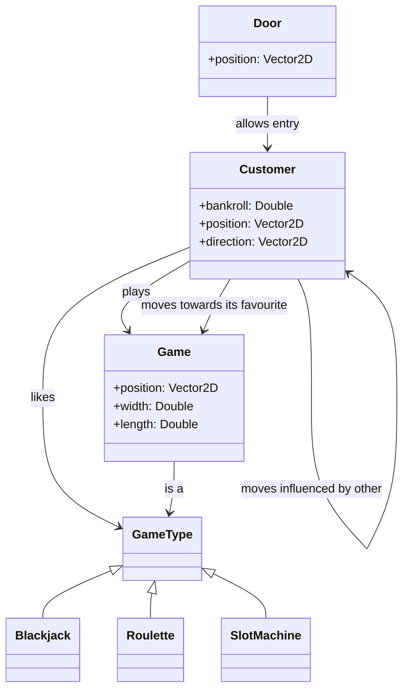

# Casimo Documentation

## Adopted Development Process
### Task division
The development process was divided into three main themes:
- Games logic (assigned to Ghignatti): responsible for implementing the core game logic.
- Customer movement behaviour (assigned to Patrignani): responsible for implementing the customer movement.
- Customer in-game behaviour (assigned to Galeri): responsible for implementing the customer in-game behaviour.

### Planned meetings/interactions
Each week the team holds a sprint start meeting in which the team establishes the tasks to be completed in the next sprint and an effort estimation. Then each task is assigned to a team member according to both the overall effort of each member and the theme of the task.
When a blocker is encountered during the development of a task, the team holds a meeting to discuss the issue and pair programming methodology is applied.
At the end of the week a retrospective meeting is held to review the progress of the tasks and to discuss any issues that may have arisen during the week.

### Choice of test/build/continuous integration tools
The team has chosen to use GitHub Actions for continuous integration and deployment. In particular a pipeline has been set up to build and run tests of the project. If the build is successful the application is deployed to the GitHub Pages of the repository.
The documentation is also automatically generated and deployed to the GitHub Pages of the repository.

## Requirement Specification
### Business requirements
The application is intended to be used by the manager of a [casino](https://en.wikipedia.org/wiki/Casino) who wants to simulate the behaviour of customers inside a given configuration of the casino in order to predict the revenue of the facility. The manager can configure the spacial organization of the casino (such walls and games) and the behaviour of both games and customers. 

### Domain model
- **Customer**: who enters the casino and plays games.
- **Game**: a game that can be played by customers, such as roulette, blackjack and slot machine.
- **Door**: a door that allows customers to enter the casino. It is where the customers enter the casino.

### Functional requirements
#### User requirements
##### Customers
The customers move around the casino according to a [boid](https://en.wikipedia.org/wiki/Boids)-like model. This modeling is taken by the first assigment of PCD course, which is available at [this repo](https://github.com/pcd-2024-2025/assignment-01). Customers are modeled by a `position` and a `velocity` and three rules are applied to them:
- **Separation**: Customers try to maintain a minimum distance from each other
```
function calculate_separation(boid, nearby_boids){
  force = (0, 0)
  for each other_boid in nearby_boids {
    if distance(boid.position, other_boid.position) < AVOID_RADIUS
      force += normalize(boid.position - other_boid.position)
  }
  return force
}
```
- **Alignment**: Customers try to align their velocity with the average velocity of their neighbors
```
function calculate_alignment(boid, nearby_boids){
  average_velocity = (0, 0)
  if size(nearby_boids) > 0:
    for each other_boid in nearby_boids 
      average_velocity += other_boid.velocity
    average_velocity /= size(nearby_boids)
    return normalize(average_velocity - boid.velocity)
  } else {
    return (0, 0)
  }
}
```
- **Cohesion**: Customers try to move towards the average position of their neighbors
```
function calculate_cohesion(boid, nearby_boids){
  center_of_mass = (0, 0)
  if size(nearby_boids) > 0:
    for each other_boid in nearby_boids
      center_of_mass += other_boid.position
    center_of_mass /= size(nearby_boids)
    return normalize(center_of_mass - boid.position) 
  } else {
	return (0, 0)
  }
}
```
- **Game attracted**: Customers are attracted by their favourite game, in particular the customer looks around for the nearest game of its favourite type and moves towards it. If no game of its liking is found, this behaviour won't affect its movements.

Each customer is affected only by the boids within a certain distance, defined by the `PERCEPTION_RADIUS`. If a boid is outside this radius, it is not considered in the calculations.
Each customer updates its position and velocity according to the following algorithm:
```
nearby_boids = collect_nearby_boids(b, boids)

separation = calculate_separation(b, nearby_boids)
alignment = calculate_alignment(b, nearby_boids)
cohesion = calculate_cohesion(b, nearby_boids)
game_attraction = calculate_game_attraction(b, games)

/* Combine forces and update velocity */
b.velocity += SEPARATION_WEIGHT * separation
b.velocity += ALIGNMENT_WEIGHT * alignment
b.velocity += COHESION_WEIGHT * cohesion
b.velocity += GAME_ATTRACTION_WEIGHT * game_attraction

/* Limit speed to MAX_SPEED */
if magnitude(b.velocity) > MAX_SPEED
b.velocity = normalize(b.velocity) * MAX_SPEED      

/* Update position */
b.position += b.velocity
```
Other parameters that influence the boids' behavior are:
- `MAX_SPEED`: maximum speed limit for boids
- `PERCEPTION_RADIUS`: distance within which a boid perceives others
- `AVOID_RADIUS`: minimum distance to avoid collisions
- `SEPARATION_WEIGHT`: weight for separation force
- `ALIGNMENT_WEIGHT`: weight for alignment force
- `COHESION_WEIGHT`: weight for cohesion force
- `GAME_ATTRACTION_WEIGHT`: weight for game attraction force.

All of these parameters can be configured by the user in order to simulate different scenarios.
When a customer is close to a game of its liking, that is the distance between the customer's and game's position is less than `SITTING_RADIUS`, the player sits and plays the game. While a customer is playing it does not move.

#### System requirements

### Non-functional requirements

### Implementation requirements

## Architectural Design
### Overall architecture
The application rely on a MVU (Model-View-Update) architecture, which is a purely functional architecture. 
Core concepts of this architecture are:
- **Model**: Represents the state of the application, a pure, immutable data structure where all state changes produce new instances.
- **View**: A function that takes the model and produces a view, which is a description of what the user interface should look like.
- **Update**: A function that takes the current model and an event (or action) and produces a new model, representing the new state of the application.


Cornerstone of this architecture is the unidirectional data flow, where at the center of the architecture is the update function, which process messages 
sent by the view and produces a new model. This kind of update function is what allow this architecture to simulate the loop of a traditional simulation application, 
maintaining the purely functional nature of the application.


### Description of architectural patterns used

### Any distributed system components

### Crucial technological choices for architecture
#### Scala.js + Laminar: Reactive Frontend & Continuous Deployment

The application rely on a browser-native UI built using **Scala.js** with **Laminar**. This choice was driven by the ability to have a continuous deployment via GitHub Pages while also adopting well to the MVU architecture. 

Laminar **fine-grained reactivity** ensures that view components update automatically when the model changes, perfectly complementing the MVU dataflow `Model → View → Update` cycle. Rather than manually propagating new state, Laminar delivers updates precisely where they’re needed.
Also, DOM changes are direct without the need of virtual-DOM abstraction, avoiding performance bottlenecks and potential stale-state problem common with other web framework.

- **Continuous Deployment**  
  Since Scala.js outputs JavaScript and HTML, our pipeline can **automatically build, test, and deploy** the application on every change. This continuous deployment setup ensures the latest version is always live without manual intervention needed.
### Diagrams

## Detailed Design
### Relevant design choices
An important design choice in our application is the use of a MVU architecture, which dictates how the application is structured and how data flows through it.
Cornerstone component is the update function, which has been designed in a way to simulate a loop in order to allow a better management of the simulation state.


#### Update
The Update system represents the core simulation engine responsible for managing the state transitions and event processing 
in a casino simulation environment. Built using functional programming principles and tail recursion optimization, 
the system processes discrete simulation events in a deterministic sequence, ensuring consistent state management across 
all simulation components including customers, games, walls, and spawners.

The Update system follows an event-driven architecture combined with the State pattern, where simulation state transitions 
are triggered by specific events processed through a central update loop. The design emphasizes immutability and functional 
composition, using tail recursion to ensure stack safety during extended simulation runs.


The system processes all state changes through discrete events, providing clear separation of concerns and making the simulation deterministic and testable.
Each event type triggers specific state transformation logic.
The `SimulationState` serves as the context, while different events represent state transition triggers. The `Update` class 
acts as the state manager, coordinating transitions between different simulation phases.


#### Customer Composition

We choose to implement the `Customer` behavior using **F‑bounded polymorphic traits**. This choice brings some great feature enabling a **modular** and **extensible** design.

```scala 3
case class Customer(
    id: String,
    bankroll: Double,
    customerState: CustState = Idle
) extends Entity,
      Bankroll[Customer],
      CustomerState[Customer]:

  protected def updatedBankroll(newRoll: Double): Customer =
    this.copy(bankroll = newRoll)

  protected def changedState(newState: CustState): Customer =
    this.copy(customerState = newState)
```
```scala 3
trait Bankroll[T <: Bankroll[T]]:
  val bankroll: Double
  require(
    bankroll >= 0,
    s"Bankroll amount must be positive, instead is $bankroll"
  )

  def updateBankroll(netValue: Double): T =
    val newBankroll = bankroll + netValue
    require(
      newBankroll >= 0,
      s"Bankroll amount must be positive, instead is $newBankroll"
    )
    updatedBankroll(newBankroll)

  protected def updatedBankroll(newBankroll: Double): T
```

The key strength of this design are:

- **Strong type safety**  
  F‑bounded traits restrict generic parameters to subtypes of the trait itself, preventing accidental type error at compile time.

- **Precise APIs and seamless mvu updates**  
  By encoding the concrete subtype via `C <: Trait[C]`, trait methods can return `C` directly, enabling `.copy(...)` function in the Customer producing a new instance in a clean and optimize way. This avoids casts or losing type specificity in method returns making updating state easier.

```scala 3
val newCustomer = Customer(id = "myCustomer", bankroll = 50.0)
val updatedCustomer = newCustomer.updateBankroll(-20.0)
// ad-hoc method for update that checks that bankroll don't go below zero
```
- **Modular and extensible architecture**  
  Each behavior (e.g., bankroll, boredom, status) is isolated within its own trait. This allows introducing new behaviour without altering existing implementations by just defining the trait and mix it in.
```scala 3
case class Customer(
id: String,
bankroll: Double,
customerState: CustState = Idle,
boredom: Double
) extends Entity,
Bankroll[Customer],
CustomerState[Customer],
Boredom[Customer]: // Just adding a new behaviour to the Customer by composition

```
By leveraging these traits composition system, our `Customer` model stays **type safe**, **cohesive**, and easy to evolve, supporting future expansion of behaviors and customer types without compromising the maintainability.

#### Customers spawner

The `Spawner` system manages the generation of entities (customers) in the simulation using configurable spawning strategies. 
The design follows these core principles:
- Decoupling : Spawners are unaware of strategy implementation details
- Flexibility : Strategies can be combined and extended
- Time-based : Strategies react to simulation time progression
- Immutability : Strategies are pure functions of time

The responsibilities of this entity are:
- Position management (where entities spawn)
- Time tracking (when entities spawn)
- Delegation to strategy (how many entities spawn)

The `SpawnerStrategy` is the entity designed to return the number of customers, following a specific strategy, to spawn which is designed to use 
generic and famous spawning behaviours and permit the user to define custom spawning strategies thanks to a scala DSL.

Kind of generic behaviour the `SpawningStrategy` should provide are:
- `constant` : mechanism to spawn a fixed number of customers every tick
- `gaussian` : mechanism to simulate a gaussian behaviour of the spawner
- `step` : mechanism where the spawn rates change abruptly at specific times

The behaviour of a `SpawningStrategy` can be modelled in an interface like:
```scala 3
trait SpawningStrategy:
  def customersAt(time: Double): Int
```


By designing the creation of these strategies through a builder we can allow to combine strategies or customize them by applying factors.
Or even better, we designed an internal DSL which boost the creativity of the user: it allows to customize the predefined 
strategies or to create your own one.

#### Walls

The `Wall` is a foundational element in our casino simulation application, serving as impassable barriers that define physical boundaries.

The `Wall` was designed with these core principles:
- Immutability: `Wall` state changes create new instances
- Reactivity: UI automatically updates when walls change
- Composability: Built from reusable traits
- Interactivity: Intuitive drag-and-drop placement
- Collision Awareness: Prevents invalid placements

Due to the numerous behaviours the `Wall` entity should have design it as a mixin is a great solution, follows the list of 
behaviours that the entity has:
- `Positioned` : express that the entity has a position
- `Sized` : which express that the entity has a size
- `CollidableEntity` : which express the fact that the entity can collide with others entity
- `SizeChangingEntity` : which express the resize behaviour of the entity

#### Games
The core abstraction is provided by the `Game` trait, representing a generic gambling station in the Casino. 
It’s designed to model concurrency and fairness while allowing flexibility across different game types. 
Three concrete implementations — `RouletteGame`, `SlotMachineGame`, and `BlackJackGame` — extend this trait to specialize behavior based on game logic and betting styles.


To deal with the concurrency on this kind of entity was decided to create some functions which allow to lock/unlock the game.
This functions will alter the `GameState` which represent the current state of the `Game`, with all the customers that are
currently playing that specific game.
Thanks to the implementation of a monad which allow to manage two different states (`Result`), deal with the error in case 
of the impossibility to play the game is easy.

Also keeping track of the gains and loss of our game is important, to avoid to overload of task our games a `GameHistory` entity was designed.
The behaviour of this entity is simple, a `GameHistory` is designed to deal with just one `Game` and the communication with it is limited,
it is designed to deal with a `DataManager` which is an entity designed for keeping track of important data in the simulation.

`GameHistory` is an Entity which keep tracks of the game history, is composition is quite simple, is a list of `Gain` which
represent the Tuple composed by the ID of the customer who played the game and the gain in terms of money the game did.

#### Game Strategies
Every game has a `GameStrategy` which is the component where is stored the strategy part of a game, it is responsible for
simulate the real-world game behaviours through some predefined strategies and custom ones

The design follows the Strategy pattern combined with the Builder pattern to create a flexible and extensible architecture for different casino games.
The system supports three main game types: Slot machines, Roulette, and BlackJack, each with customizable betting strategies and conditions.

The system is built around a core trait `GameStrategy` that defines the contract for all gambling strategies. 
Each game type implements this strategy through a two-phase construction process: a builder phase for configuration and an instance phase for execution.

A dedicated DSL module provides a more natural and readable way to construct strategies, making the API more user-friendly and expressive.


The flow from the creation of the strategies to their use is modelled with the following flowchart:


## Implementation
### Student contributions
Nicolò Ghignatti
#### Result
Having to deal with data which can have two states (win or loss for a bet, for example) can be quite annoying so, I've 
decided to implement a monad which can do it for us. Basically it is a enum which can have 2 states: a 
`Success` or a `Failure`:
```scala
package utils

enum Result[+T, +E]:
  case Success(value: T)
  case Failure(error: E)

  def map[U](f: T => U): Result[U, E] = this match
    case Success(value) => Success(f(value))
    case Failure(error) => Failure(error)

  def flatMap[U, F](f: T => Result[U, F]): Result[U, E | F] = this match
    case Success(value) => f(value)
    case Failure(error) => Failure(error)

  def getOrElse[U >: T](default: U): U = this match
    case Success(value) => value
    case Failure(_)     => default

  def isSuccess: Boolean = this match
    case Success(_) => true
    case Failure(_) => false

  def isFailure: Boolean = !isSuccess
```
This kind of implementation help also in the error handling

#### Games
I've dealt with the game implementation in their totality. The crucial point was dealing with the customers, so useful APIs
have been implemented, allowing the players to join games and play them.
```scala
class Game extends Entity:
  def gameType: GameType
  def lock: Result
  def unlock: Result
  def play: Result
```
An important task was to manage the customers joining a game, allowing the to join if possible, otherwise block them.
This mechanism has been implemented in a `GameState` which manage the join/leave mechanism:
Instead the logic of the games was implemented using an internal DSL, which expose useful stuff to implement strategies
in an easy way:
```scala
// this is an example of how the game strategy DSL was implemented
trait GameStrategy:
    def use(): Result[Double, Double]

object SlotStrategy:
    def apply: SlotStrategyBuilder = SlotStrategyBuilder()

case class SlotStrategyBuilder( betAmount, condition):
    def bet(amount: Double): SlotStrategyBuilder =
      require(amount > 0.0, "Bet amount must be positive")
    this.copy(betAmount = Some(amount))

def when(cond: => Boolean): SlotStrategyInstance =
  SlotStrategyInstance(betAmount.getOrElse(0.0), () => cond)

case class SlotStrategyInstance(betAmount, condition) extends GameStrategy:
    override def use(): Result[Double, Double] =
        val values =
          for _ <- 1 to 5 yield Random.nextInt(5) + 1
        if condition() && values.distinct.size == 1 then
          Result.Success(betAmount * 10)
        else Result.Failure(betAmount)
```
Allowing an easy creation like the following:
```scala 3
val bankroll = 10.0
use(SlotStrategy) bet 5.0 when (bankRoll > 0.0)
```

### Patrignani Luca
#### Customer movements
The customer movements are modeled according to the previously presented architecture: a trait `Movable` is defined as such
```scala 3
trait Movable[T <: Movable[T]]:
  val direction: Vector2D
  val position: Vector2D

  def updatedPosition(newPosition: Vector2D): T

  def updatedDirection(newDirection: Vector2D): T
```
and all movement managers depend only on this trait, not on the concrete implementation of the `Customer`.
Two movement managers have been implemented:
- **Boid-like movement**: this implements the boid-like movement described in the user requirements section. It is obtained by combining three other managers, each one implementing one of the three boid-like rules: **Separation**, **Alignment** and **Cohesion**.
Since the boids logic for a single customer need not only its position and velocity, but also information about the other customers, the `Boids.State` case class is defined, which contains all the information needed to compute the movement of the boid. Then an adapter manager is defined to adapt the `SimulationState` to the necessary `Boids.State` and vice versa. This allows to keep the movement logic independent from the simulation state. The following class diagram describes the dependencies taking as example the `AlignmentManager`, the `SeparationManager` and the `CohesionManager` are implemented in the same way:

- **Game attraction movement**: this manager implements the game attraction movement, which is the movement of the customer towards its favourite game. The customer's favourite game is needed, so a new trait `Player` is defined extending `Movable`. Similarly to the boids movement managers, the `GamesAttractivenessManager` depends on a `Context` case class, which contains all the information needed to compute the movement of the customer towards its favourite game. The following class diagram describes the dependencies:

#### Manager composition
All movement managers are implemented independently from one another, to combine them a simple bash-like DSL is created: to combine two managers the `|` operator is used, similarly to what the `andThen` method does in Scala between two functions. This operator is also used to apply a manager to update the current state. In order to weight the contribution of each manager the trait `WeightedManager` is defined which supports the `*` operator. The `*` operator multiplies the contribution of the manager by a given weight. The following example shows how to obtain a manager which combines various components to obtain a boids-like movement:
```scala 3
val boidManager : BaseManager[SimulationState] = BoidsAdapter(
        PerceptionLimiterManager(perceptionRadius)
          | alignmentWeight * AlignmentManager()
          | cohesionWeight * CohesionManager()
          | separationWeight * SeparationManager(avoidRadius)
          | VelocityLimiterManager(maxSpeed)
          | MoverManager()
      )
```
So given an initial `SimulationState`, the `boidManager` can be applied to it to obtain an updated state, which contains the updated positions and velocities of the customers:
```scala 3
val state : SimulationState = ???
val updatedState = state | boidManager
```

### Important implementation aspects

## Testing
### Technologies used
For testing our code we used ScalaTest, probably, the most widely used and flexible testing framework for Scala.
The choice of this testing technology has different pros:
- **Rich Testing Styles**: With multiple built-in styles—such as FlatSpec, FunSuite, FunSpec, WordSpec, FreeSpec, 
    PropSpec, and FeatureSpec—ScalaTest enables you to write tests in the style that best fits your needs: xUnit, BDD, 
    nested specification, or property-based testing
- **Powerful Matchers & DSL**: ScalaTest includes expressive matchers that allow fluent assertions
- **Deep Ecosystem Integration**: ScalaTest integrates with build tools and frameworks including sbt, Maven, Gradle, 
    IntelliJ, Eclipse, and testing tools like JUnit, TestNG, ScalaCheck, JMock, EasyMock, Mockito, and Selenium

### Coverage level

### Methodology used

### Relevant examples

### Other useful elements

## Retrospective
### Development progress, backlog, iterations

### Final comments
