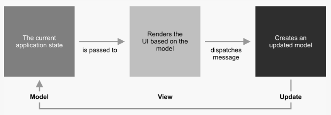
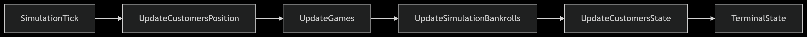

# Casimo Documentation

## Adopted Development Process
### Task division methods

### Planned meetings/interactions

### Ongoing task review methods

### Choice of test/build/continuous integration tools

## Requirement Specification
### Business requirements

### Domain model

### Functional requirements
#### User requirements

#### System requirements

### Non-functional requirements

### Implementation requirements

## Architectural Design
### Overall architecture
The application rely on a MVU (Model-View-Update) architecture, which is a purely functional architecture. 
Core concepts of this architecture are:
- **Model**: Represents the state of the application, a pure, immutable data structure where all state changes produce new instances.
- **View**: A function that takes the model and produces a view, which is a description of what the user interface should look like.
- **Update**: A function that takes the current model and an event (or action) and produces a new model, representing the new state of the application.

Cornerstone of this architecture is the unidirectional data flow, where at the center of the architecture is the update function, which process messages 
sent by the view and produces a new model. This kind of update function is what allow this architecture to simulate the loop of a traditional simulation application, 
maintaining the purely functional nature of the application.

### Description of architectural patterns used

### Any distributed system components

### Crucial technological choices for architecture

### Diagrams

## Detailed Design
### Relevant design choices
An important design choice in our application is the use of a MVU architecture, which dictates how the application is structured and how data flows through it.
Cornerstone component is the update function, which has been designed in a way to simulate a loop in order to allow a better management of the simulation state.

### Design patterns

### Code organization

### Diagrams

## Implementation
### Student contributions
For each student: description of what was done/co-done and with whom

### Important implementation aspects

## Testing
### Technologies used

### Coverage level

### Methodology used

### Relevant examples

### Other useful elements

## Retrospective
### Development progress, backlog, iterations

### Final comments
